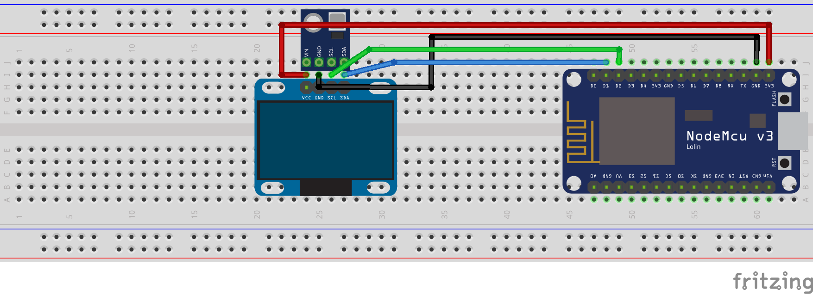
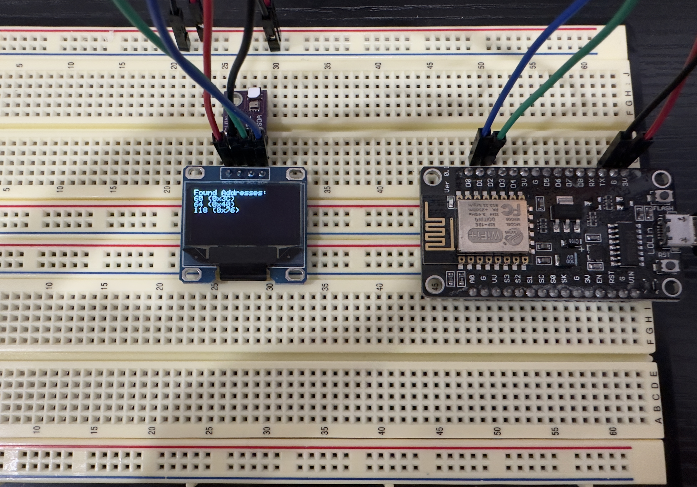

export { BlogLayout as layout } from "@components/BlogLayout";

import CodeBlock from "@components/CodeBlock";
import SketchSource from "./files/sketch.ino?raw";

This tutorial explains how to discover i2c devices such as the SSD1306 and GY-21P.

From a high level overview, i2c allows to create a signal line of communication between multiple devices without having to physically address them. This is extremely useful for projects that might not have many ports on the device, but need to manage multiple peripherals.

:::tip
[Sparkfun has a great in depth look at what i2c is](https://learn.sparkfun.com/tutorials/i2c/all)
:::

## Supplies

- (1) esp8266
- (1) GY-21
- (1) SSD1306
- (6) Jumper wires

## Setup

## Coding

For this project, we are using the following libraries:

1. [Adafruit_SSD1306](https://github.com/adafruit/Adafruit_SSD1306)

### Flash settings

- Board: NodeMCU 1.0 (ESP-12E Module)
- CPU Frequency: 80MHZ
- Upload Speed: 115200

:::info
In the example below you can see a line for `display.begin(SSD1306_SWITCHCAPVCC, 0x3C)`. `0x3C` is the address that we are going to communicate with the display over i2c! We can discover other devices and use i2c to display that via our screen!
:::

<CodeBlock language="cpp" showLineNumbers={true}>
  {SketchSource}
</CodeBlock>

:::info
Once you flash you should see the following output on your SSD1306 screen.
:::

