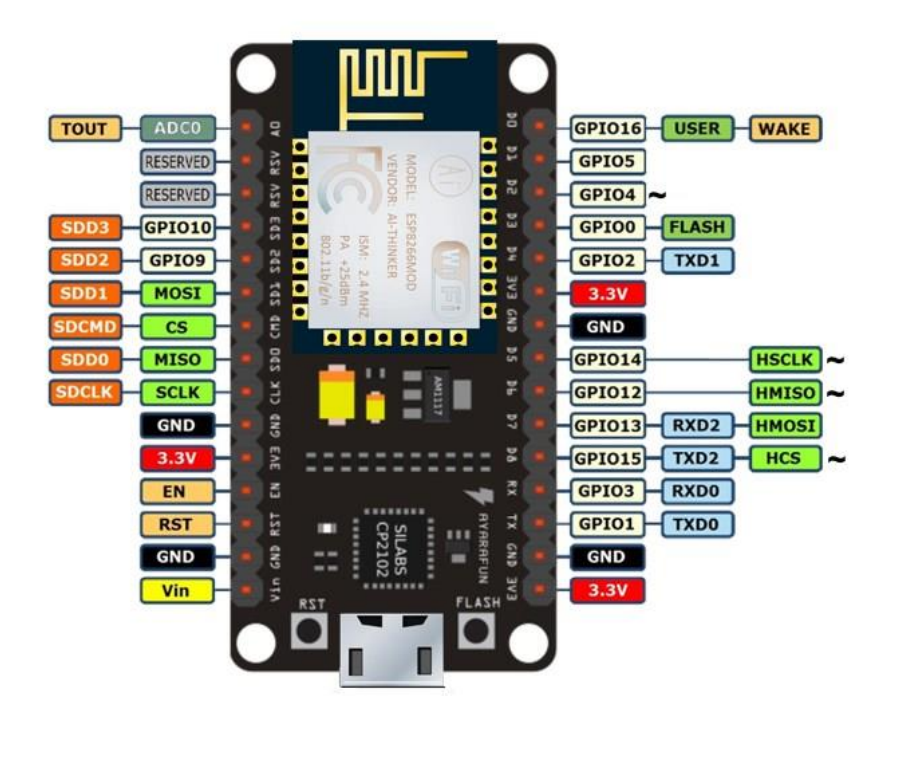
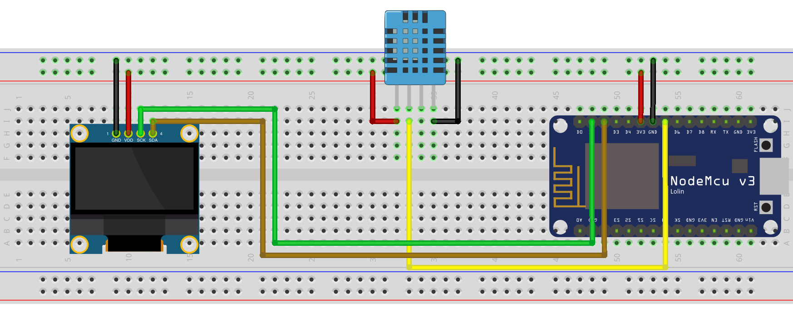
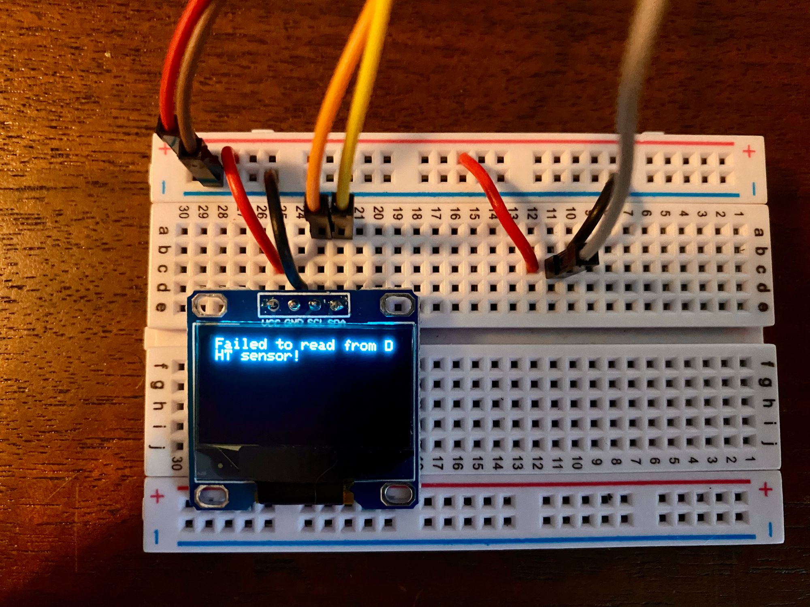
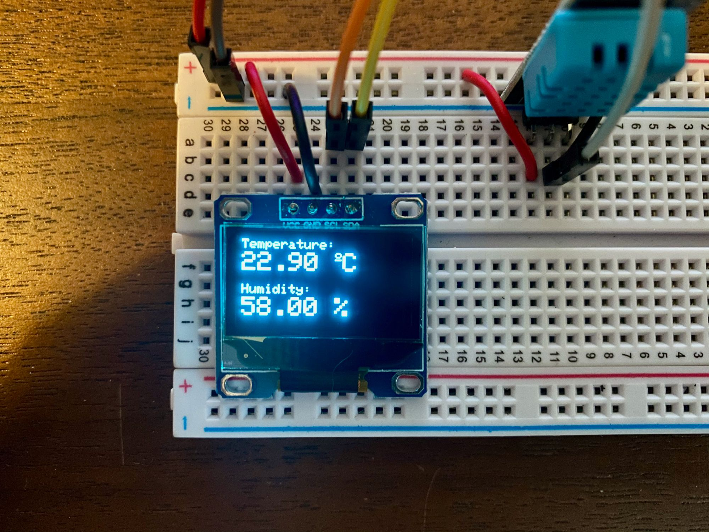
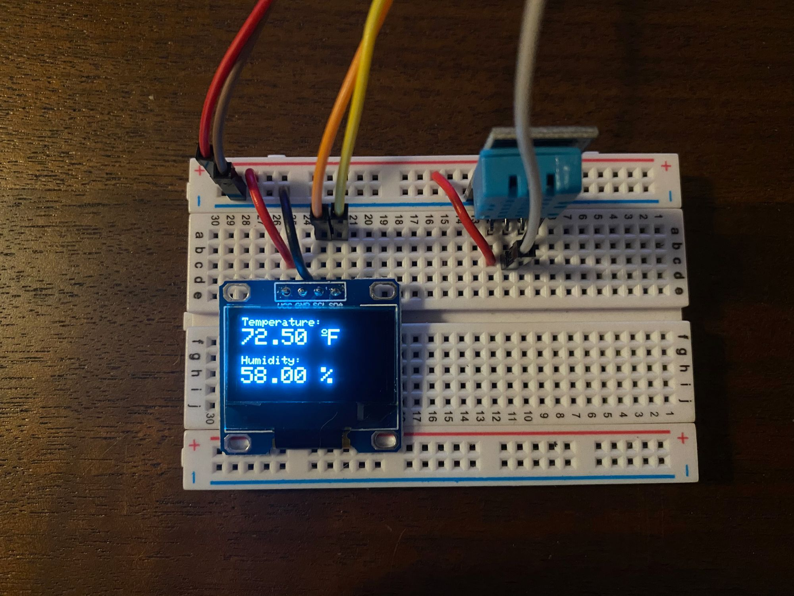

import CodeBlock from "@components/CodeBlock";
import SketchSource from "./files/sketch.ino?raw";

This tutorial goes over how to use the following to make a functioning weather station! 🌦

## Supplies

- (1) ESP8266 Wi-Fi Microcontroller (NodeMCU v3)
- (1) 0.96 " OLED 1306
- (1) DHT11
- (8) Jumper wires

> For reference I have included the pinout diagram for the ESP8266 Wi-Fi Microcontroller (NodeMCU v3) that I am using.

## Setup

## Code

For this project, we are using the following libraries:

1. Adafruit_GFX
2. Adafruit_SSD1306
3. Adafruit_Sensor

> For information on how to install the libraries above please visit [https://www.arduino.cc/en/guide/libraries](https://www.arduino.cc/en/guide/libraries).

<CodeBlock language="cpp" showLineNumbers={true}>
  {SketchSource}
</CodeBlock>

If all the parts are working accordingly, you will see the following for having a DHT11 sensor and when you don't.

States of being able to read the DHT11 sensor data.

> If you want to display the output as Fahrenheit all you need to do is change `dht.readTemperature();` to `dht.readTemperature(true);`. Changing the following and changing `display.print("C");` to `display.print("F");` will yeild the following results.

