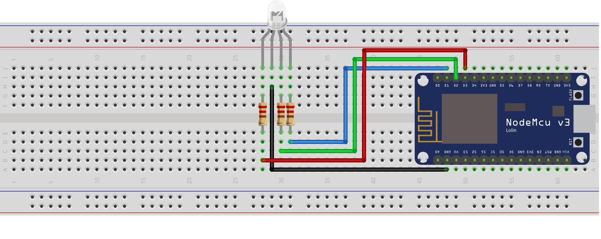

import CodeBlock from "@components/CodeBlock";
import SketchSource from "./files/sketch.ino?raw";

This tutorial goes over how to control an RGB LED with an Arduino ESP8266 🚦

## Supplies

- (1) LED - RGB Diffused Common Cathode
- (3) Resistor 220 ohm
- (4) Jumper wires
- (1) ESP8266 Wi-Fi Microcontroller (NodeMCU v3)

> For refrence I have included the pinout diagram for the ESP8266 Wi-Fi Microcontroller (NodeMCU v3) that I am using.

## Setup

## Code

> This project does not require any additional libraries. The Arduino standard lib is enough.

<CodeBlock language="cpp" showLineNumbers={true}>
  {SketchSource}
</CodeBlock>

