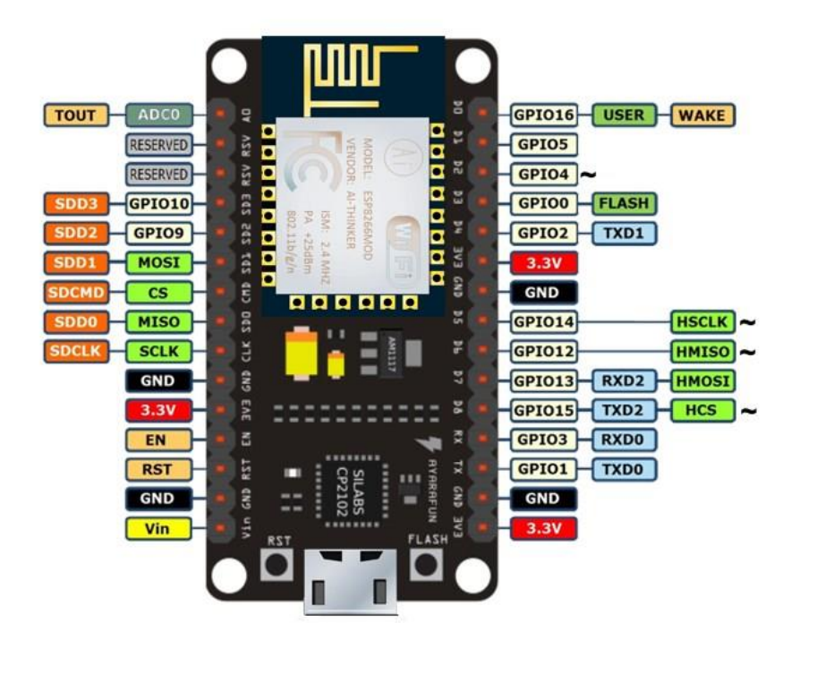
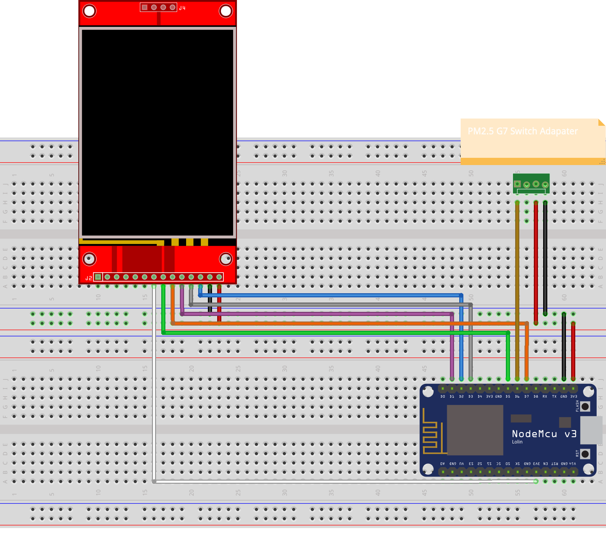
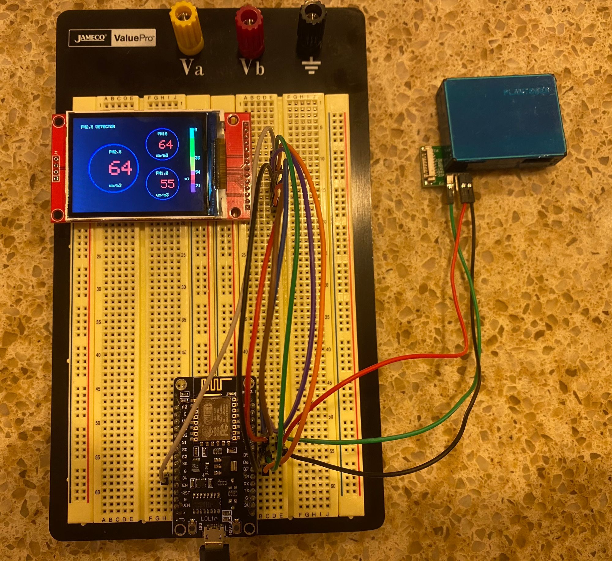
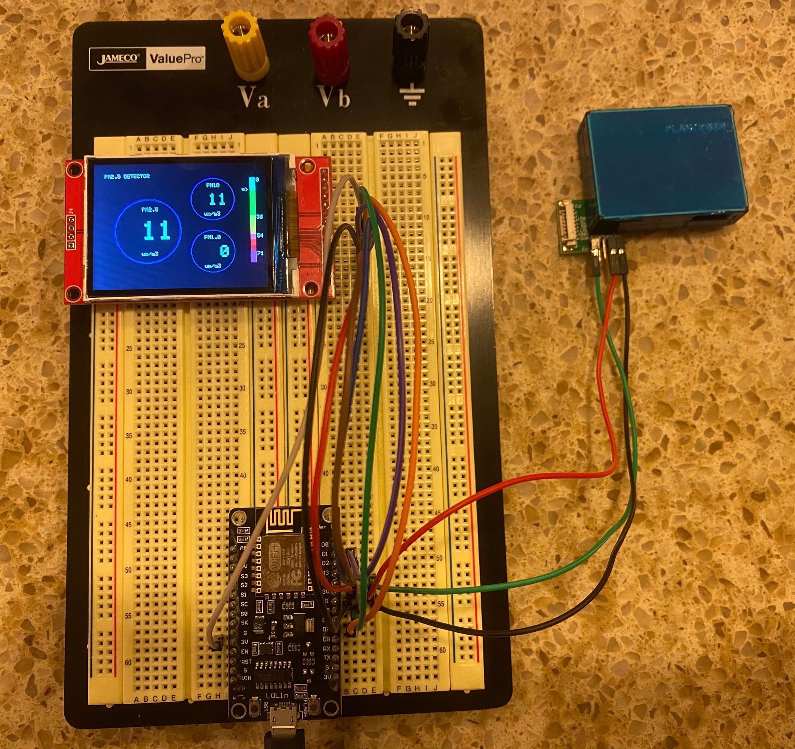

import CodeBlock from "@components/CodeBlock";
import SketchSource from "./files/sketch.ino?raw";

This tutorial goes over how to use the Plantower PMS7003 PM2.5 Sensor 💨!

## Supplies

- (1) PM2.5 Sensor (Plantower PMS7003)
- (1) G7 Switch Adapter
- (11) Jumper wires
- (1) ESP8266 Wi-Fi Microcontroller (NodeMCU v3)

> _For refrence I have included the pinout diagram for the ESP8266 Wi-Fi Microcontroller (NodeMCU v3) that I am using._

## Setup

## Code

For this project, we are using the following libraries:

1. Adafruit_GFX
2. Adafruit_ILI9341
3. Adafruit_PM25AQI

> _For information on how to install the libraries above please visist _[_https://www.arduino.cc/en/guide/libraries_](https://www.arduino.cc/en/guide/libraries)_._

<CodeBlock language="cpp" showLineNumbers={true}>
  {SketchSource}
</CodeBlock>

:::info
Initial boot vs 20 seconds after, it is important to let the pm2.5 sensor acclimate.
:::

