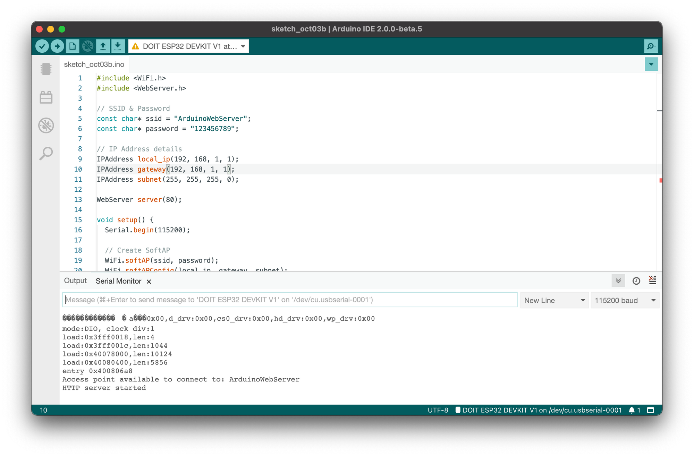
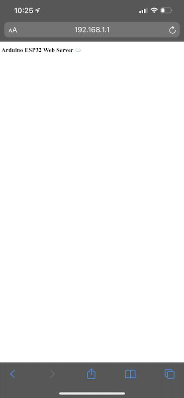
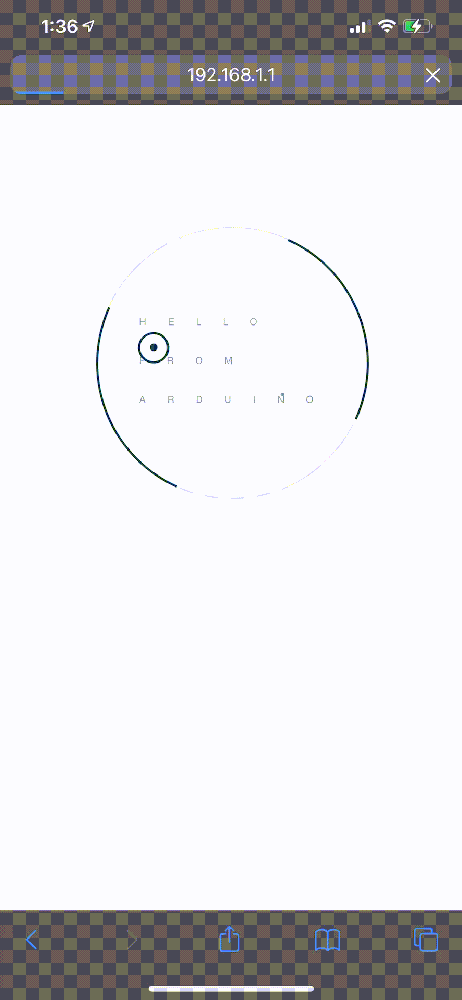

import CodeBlock from "@theme/CodeBlock";
import IndexHTMLSource from "!!raw-loader!./files/data/index.html";
import SketchSource from "!!raw-loader!./files/sketch.ino";

This tutorial goes over how to create an access point and serve web pages from an esp32 ☁️!

<!-- truncate -->

## Supplies

- (1) esp32


## Code

For this project, we are using the following libraries:

- Wifi.h (built-in)
- WebServer.h [(built-in provided by espressif with the esp32 firmware)](https://github.com/espressif/arduino-esp32/blob/master/libraries/WebServer/src/WebServer.h).
- SPIFFS.h (built-in)

```cpp showLineNumbers
#include <WiFi.h>
#include <WebServer.h>

// SSID & Password
const char* ssid = "ArduinoWebServer";
const char* password = "123456789";

// IP Address details
IPAddress local_ip(192, 168, 1, 1);
IPAddress gateway(192, 168, 1, 1);
IPAddress subnet(255, 255, 255, 0);

WebServer server(80);

void setup() {
  Serial.begin(115200);

  // Create SoftAP
  WiFi.softAP(ssid, password);
  WiFi.softAPConfig(local_ip, gateway, subnet);


  Serial.print("Access point available to connect to: ");
  Serial.println(ssid);

  server.on("/", handle_root);

  server.begin();
  Serial.println("HTTP server started");
  delay(100);
}

void loop() {
  server.handleClient();
}

String HTML = "<!DOCTYPE html>\
  <html>\
  <body>\
  <h1>Arduino ESP32 Web Server &#9729;</h1>\
  </body>\
  </html>";

// Handle root url (/)
void handle_root() {
  server.send(200, "text/html", HTML);
}
```

> If you are uploading this via Arduino IDE, you might see a timeout. An easy way to fix this is to press the boot button on the ESP32 when trying to upload.

Once this has been uploaded, you should be able to see the following in the serial monitor output:


Arduino IDE showing the serial monitor output once the sketch above has been uploaded. When connecting to the access point via your computer or your phone, you should see the following once you navigate to `192.168.1.1` via your browser after connecting:



Navigating to 192.168.1.1, you should see the output for the HTML described in the sketch.
There you go! We can successfully serve web traffic when a device connects to the ESP32 and then navigates to `192.168.1.1`!

Writing any application or serving just a web page will not be enough for working on projects. With the ESP32, we have access to [SPIFFS](https://github.com/espressif/arduino-esp32/blob/master/libraries/SPIFFS/src/SPIFFS.h); this is built-in and provided by espressif, which gives you access to the filesystem.

## Serving from the file system

To serve things from the file system, getting things on the file system for the ESP32 is the first requirement. Fortunately, there is a [plugin that allows this for the Arduino IDE.](https://github.com/me-no-dev/arduino-esp32fs-plugin/releases/)

> If you are using a esp32-c3 or esp-s2 please use the patched plugin as the one mentioned previously does not work with those modules [https://github.com/lorol/arduino-esp32fs-plugin](https://github.com/lorol/arduino-esp32fs-plugin)

Following the[instructions on the README](https://github.com/me-no-dev/arduino-esp32fs-plugin) will allow you to have a new option in the tools dropdown called `ESP32 Sketch Data Upload` menu item. Once the plugin is installed, creating a folder in your sketch directory called `data` will be transferred to the ESP32's file system when executed.

> [Note that this tool works with the Java IDE for Arduino and is currently an open issue with the rewrite for Arduino IDE 2.0](https://github.com/arduino/arduino-ide/issues/58)

Creating an `index.html` in the data directory with the contents of:

<CodeBlock language="html" showLineNumbers={true}>
  {IndexHTMLSource}
</CodeBlock>

And also updating our sketch to include the `SPIFFS` code below;

<CodeBlock language="cpp" showLineNumbers={true}>
  {SketchSource}
</CodeBlock>

Uploading the new sketch and then running the tool to upload the index.html in the data directory `ESP32 Sketch Data Upload` will yield the following results when visiting `192.168.1.1`.


