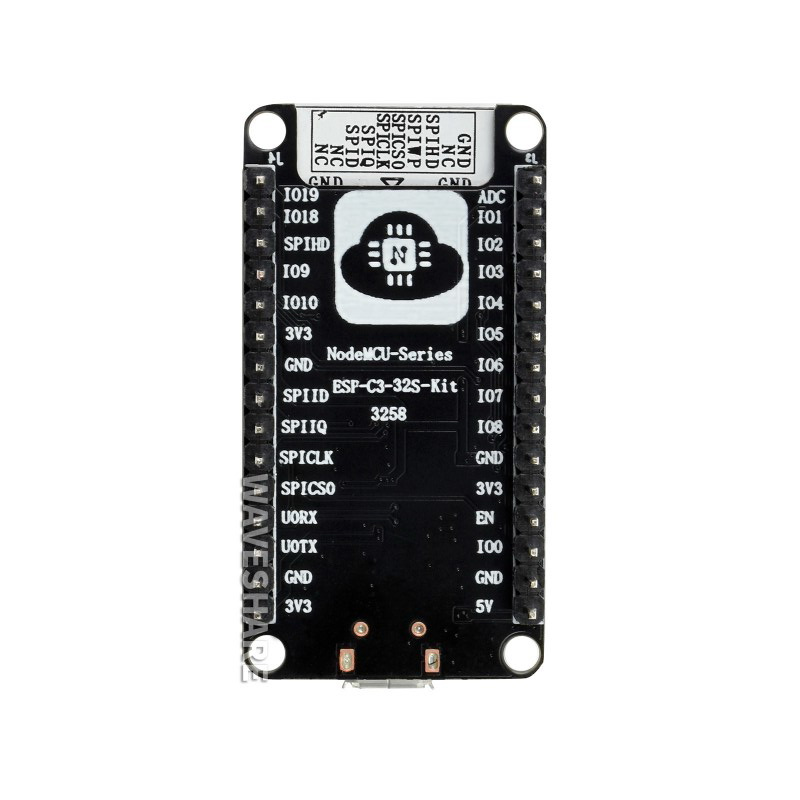
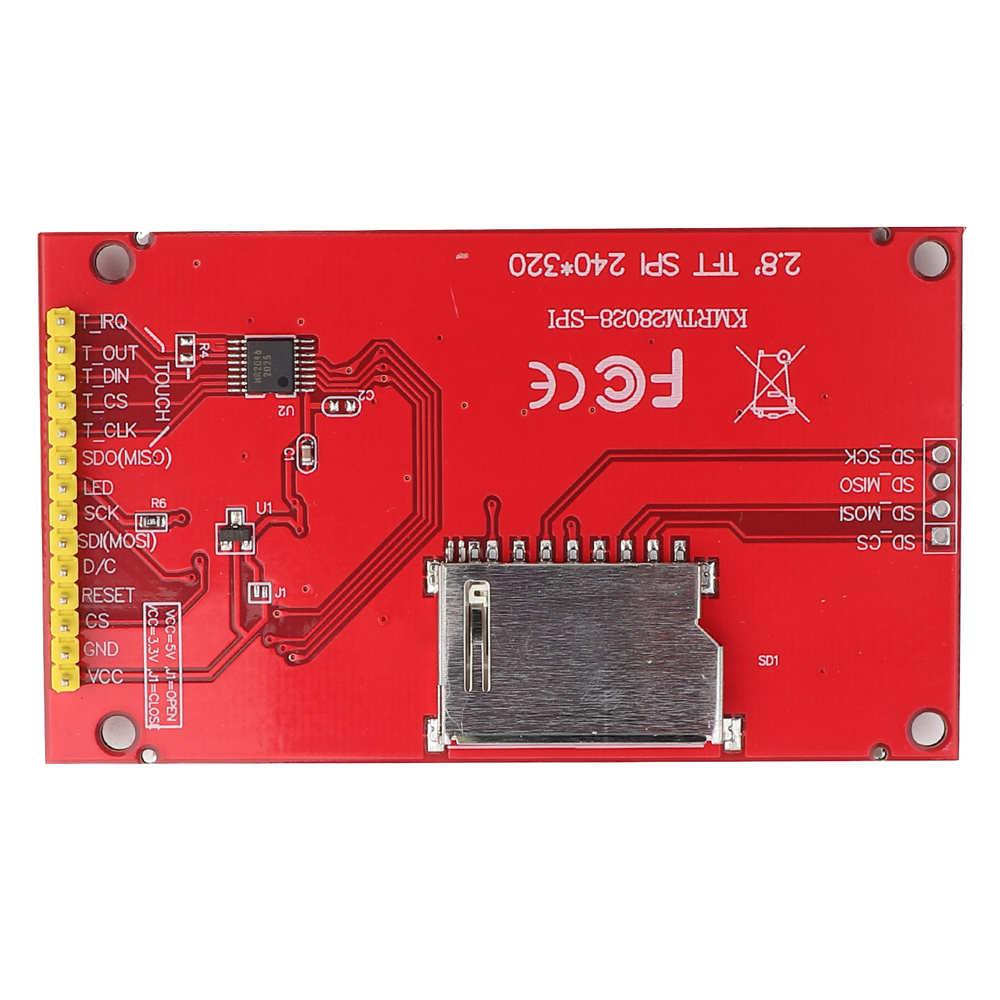
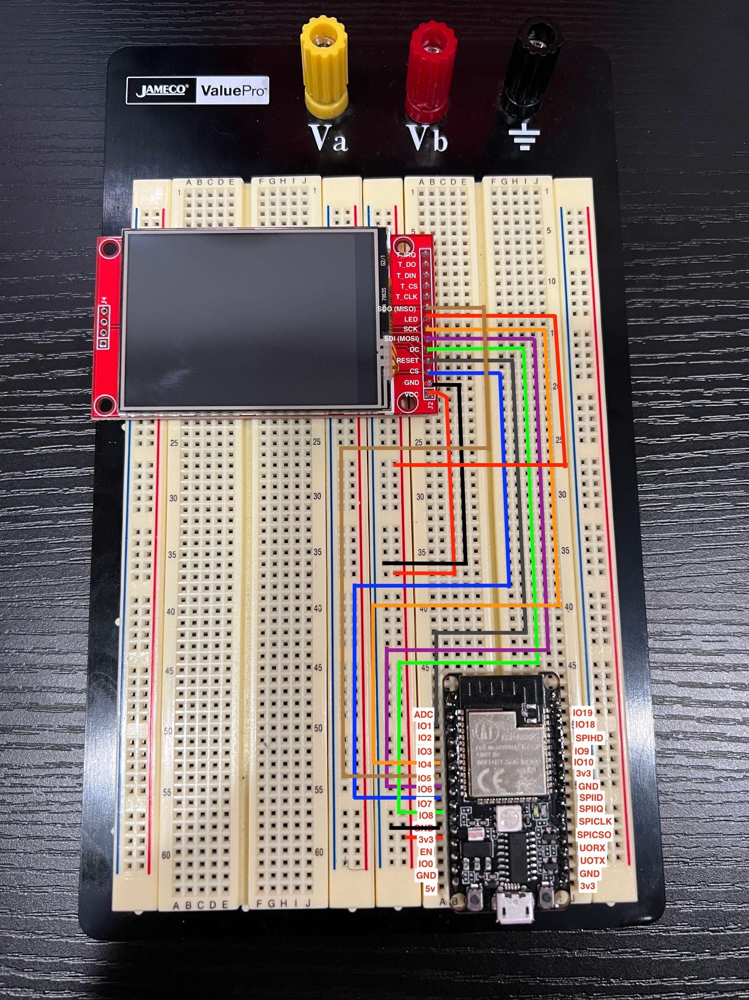

import CodeBlock from "@theme/CodeBlock";
import SketchSource from "!!raw-loader!./files/sketch.ino";

This tutorial goes over how to use an ILI9341 TFT screen with the esp32-c3-32s!

<!-- truncate -->

## Supplies

- (1) esp32-c3-32s
- (1) ILI9341 TFT Screen
- (1) Breadboard
- (8) Jumper cables

## Setup

As this board is extremely small compared to the esp32 that preceded it, the pinout information is on the back of the chip.





As this is not a widely used board, I couldn't find a fritzing for it, so I am going to try and make this easy by putting both the board together for you to be able to connect via jumper cables however you please.

| esp32-c3-32s Pin | TFT Pin    |
| ---------------- | ---------- |
| 3v3              | VCC        |
| GND              | GND        |
| IO7              | CS         |
| IO1              | RESET      |
| IO2              | DC         |
| IO6              | SDI (MOSI) |
| IO4              | SCK        |
| LED              | 3v3        |



## Code

For this project, we are using the following libraries:

1. Adafruit_GFX
2. Adafruit_ILI9341

> _For information on how to install the libraries above please visist _[_https://www.arduino.cc/en/guide/libraries_](https://www.arduino.cc/en/guide/libraries)_._

_The following graphics test code was pulled from <https://github.com/adafruit/Adafruit_ILI9341/blob/master/examples/graphicstest/graphicstest.ino>_

### Flash settings

- USB CDC on boot: disabled
- Board: ESP32c3 Dev Module
- CPU Frequency: 80MHZ
- Flash Frequency: 80MHZ
- Flash Mode: DIO
- Flash Size: 4MB
- Partition Scheme: Default 4MB with spiffs
- Upload Speed: 115200

<CodeBlock language="cpp" showLineNumbers={true}>
  {SketchSource}
</CodeBlock>

Upon running this you should be able to get the following output


For those who are running this with a hardware SPI or something that looks like

```cpp
#define TFT_CS   7
#define TFT_DC   2
#define TFT_MOSI 6
#define TFT_CLK  4
#define TFT_RST  1
#define TFT_MISO 5

Adafruit_ILI9341 tft = Adafruit_ILI9341(TFT_CS, TFT_DC, TFT_MOSI, TFT_CLK, TFT_RST, TFT_MISO);
```

Using hardware SPI, incredibly slow. For more details visit [https://github.com/adafruit/Adafruit_ILI9341/issues/65](https://github.com/adafruit/Adafruit_ILI9341/issues/65)
This will yield incredibly slow results. This is called out in an open issue [https://github.com/adafruit/Adafruit_ILI9341/issues/65](https://github.com/adafruit/Adafruit_ILI9341/issues/65) and was originally the most frustrating part about trying to get the esp32-c3-32s working with an ILI9341 TFT screen. After I made the changes to use a software SPI it was incredibly fast.

```cpp
#define TFT_CS   7
#define TFT_DC   2
#define TFT_RST  1

Adafruit_ILI9341 tft = Adafruit_ILI9341(TFT_CS, TFT_DC, TFT_RST);
```

This is using a software SPI which is way faster than hardware SPI.
