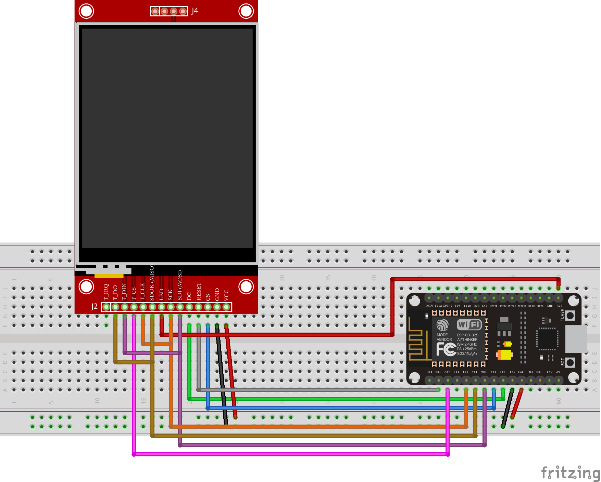

This tutorial goes over how to use an ILI9341 with a touchscreen driven by an esp32-c3-32s!

## Supplies

- (1) esp32-c3-32s
- (13) Jumper wires
- (1) ILI9341 with Touchscreen

> _For refrence I have included the pinout diagram for the esp32-c3-32s that I am using._

[esp-c3-32s-kit-v1.0_specification.pdf](../files/spec-sheets/esp32-c3-32s/esp-c3-32s-kit-v1.0_specification.pdf)

## Checkup

It's always good to double-check we are using the right screen as many screens look touch-capable but are not. Check out the steps to make sure they are by reading [https://www.gabrielcsapo.com/hardware-how-to-identify-an-ili9341-that-supports-touch/](../2021-07-11-thoughts-hardware-with-a-face-building-projects-with-interactivity/2021-07-11-thoughts-hardware-with-a-face-building-projects-with-interactivity.md).

## Setup

Alright, now that we have figured out if the touchscreen you have is touch-capable, time to set up the esp32-c3-32s and the ILI9341 display.

| esp32-c3-32s Pin | TFT Pin    |
| ---------------- | ---------- |
| 3v3              | VCC        |
| GND              | GND        |
| IO7              | CS         |
| IO1              | RESET      |
| IO8              | DC         |
| IO6              | SDI (MOSI) |
| IO4              | SCK        |
| LED              | 3v3        |
| IO4              | T_CLK      |
| IO2              | T_CS       |
| IO6              | T_DIN      |
| IO5              | T_DO       |



[arduino-esp32-c3-32s-ili9341-with-touchscreen.fzz](../files/fritzing-parts/arduino-esp32-c3-32s-ili9341-with-touchscreen.fzz)

## Coding

For this project, we are using the following libraries:

1. [Adafruit_GFX](https://github.com/adafruit/Adafruit-GFX-Library)
2. [Adafruit_ILI9341](https://github.com/adafruit/Adafruit_ILI9341)
3. [XPT2046_Touchscreen](https://github.com/PaulStoffregen/XPT2046_Touchscreen)

> _For information on how to install the libraries above please visist _[_https://www.arduino.cc/en/guide/libraries_](https://www.arduino.cc/en/guide/libraries)_._

### Flash settings

- USB CDC on boot: disabled
- Board: ESP32c3 Dev Module
- CPU Frequency: 80MHZ
- Flash Frequency: 80MHZ
- Flash Mode: DIO
- Flash Size: 4MB
- Partition Scheme: Default 4MB with spiffs
- Upload Speed: 115200

```cpp showLineNumbers
#include "Adafruit_GFX.h"
#include "Adafruit_ILI9341.h"
#include <XPT2046_Touchscreen.h>
#include <SPI.h>

#define _sclk              4
#define _mosi              6
#define _miso              5

#define CS_PIN 2

#define TFT_DC 8
#define TFT_CS 7
#define TFT_RST  1

XPT2046_Touchscreen ts(CS_PIN);

Adafruit_ILI9341 tft = Adafruit_ILI9341(TFT_CS, TFT_DC, TFT_RST);

void setup() {
  Serial.begin(38400);

  SPI.begin( _sclk, _miso, _mosi );
  SPI.setFrequency( 40000000 );

  tft.begin(4000000);
  tft.setRotation(1);
  tft.fillScreen(ILI9341_BLACK);
  ts.begin();
  ts.setRotation(1);
  while (!Serial && (millis() <= 1000));
}

boolean wastouched = true;

void loop() {
  boolean istouched = ts.touched();
  if (istouched) {
    TS_Point p = ts.getPoint();
    if (!wastouched) {
      tft.fillScreen(ILI9341_BLACK);
      tft.setTextColor(ILI9341_YELLOW);
      tft.setCursor(60, 80);
      tft.print("Touch");
    }
    tft.fillRect(100, 150, 140, 60, ILI9341_BLACK);
    tft.setTextColor(ILI9341_GREEN);
    tft.setCursor(100, 150);
    tft.print("X = ");
    tft.print(p.x);
    tft.setCursor(100, 180);
    tft.print("Y = ");
    tft.print(p.y);
    Serial.print(", x = ");
    Serial.print(p.x);
    Serial.print(", y = ");
    Serial.println(p.y);
  } else {
    if (wastouched) {
      tft.fillScreen(ILI9341_BLACK);
      tft.setTextColor(ILI9341_RED);
      tft.setCursor(120, 50);
      tft.print("No");
      tft.setCursor(80, 120);
      tft.print("Touch");
    }
    Serial.println("no touch");
  }
  wastouched = istouched;
  delay(100);
}
```

Upon running this, you should be able to get the following output


