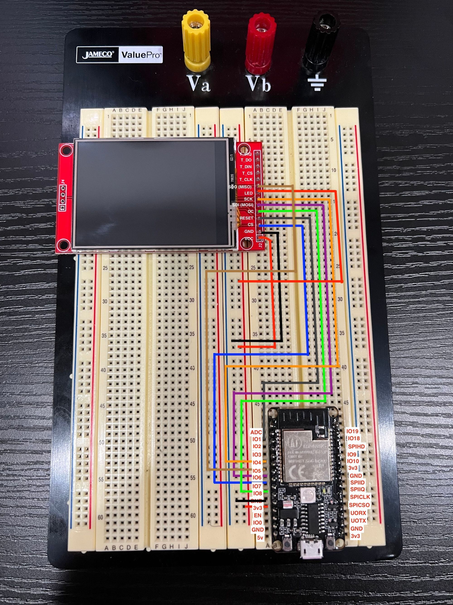

I have played around with the esp32-c3-32s for a while, and it doesn't have a decent fritzing board. So I have been forced to make some less than optimal images showing a simple project on a breadboard.

There is an overhead to being able to edit existing boards. I have yet to understand how boards are created from scratch, because they look so accurate!

<!-- truncate -->

Without any adieu here is the side by side of the before and after when creating an esp32-c3-32s board in fritzing.

> I have also edited the SPI tft screen I found to have the labels on the front of the board to more easily know which pins are going where.

If you want to download the esp32-c3-32s board you can do that [here](../files/fritzing-parts/esp32-c3-32s.fzpz). For the improved SPI tft display you can get that [here](../files/fritzing-parts/2.8%22%20SPI%20TFT%20Module.fzpz).
