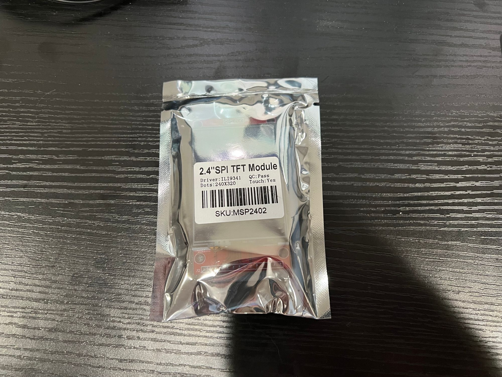
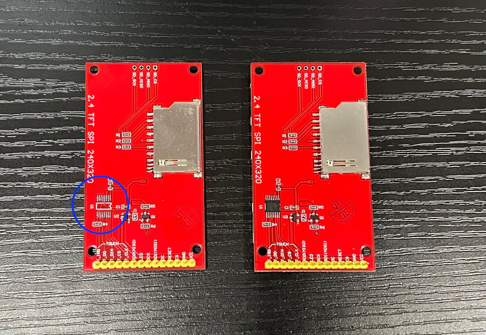
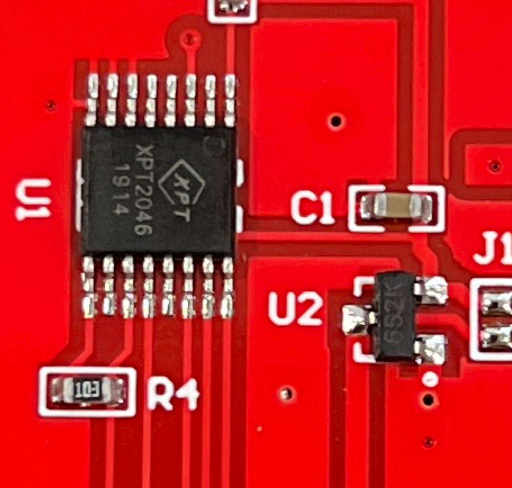

:::info
This article is meant to help you identify an ILI9341 screen that contains all the proper components to support touch.
:::

<!-- truncate -->

One of the essential things is identifying an ILI9341 capable of touch! When you buy a new display, the package might have the required information it, is it touch or not.

If the screen was loose, it might have the pins to support touch but missing the XPT2046 chip that makes it capable of touch. As seen below, the display on the left is missing the XPT2046 chip, while the display on the right has the chip and can support touch.

["The **_XPT2046_** is a 4-wire resistive touch screen controller that incorporates a 12-bit 125 kHz sampling SAR type"](https://www.google.com/url?sa=t&rct=j&q=&esrc=s&source=web&cd=&ved=2ahUKEwi_uZmw1sT1AhXfIEQIHXrFAncQFnoECAYQAQ&url=https%3A%2F%2Fldm-systems.ru%2Ff%2Fdoc%2Fcatalog%2FHY-TFT-2%2C8%2FXPT2046.pdf&usg=AOvVaw3zbUPXSfkIyFFoCL1HGraq) it is a small chip but unlocks being able to use the touch screen!

