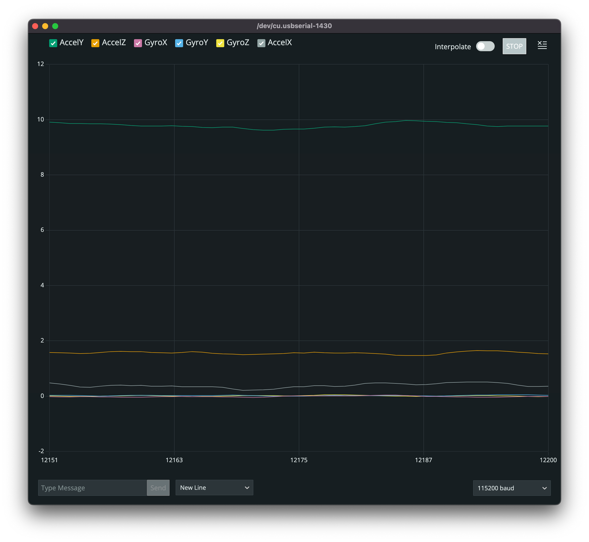

import CodeBlock from "@components/CodeBlock";
import SketchSource from "./files/sketch.ino?raw";

This tutorial explains how to use a GY-521 driven by an esp32-c3! This is an I2C board with a combined Gyroscope and Accelerometer. It has the ability to get:

- X, Y and Z acceleration
- X, Y, Z gyroscope
- Temperature sensor

This board also has the ability to change the quality of the data being processed internally by the DMP (Internal Digital Motion Processing) unit which handles filtering out data based on the settings. With that, the device can also handle being put to sleep.

> I linked the spec sheet I found originally from [http://www.haoyuelectronics.com/Attachment/GY-521/mpu6050.pdf](http://www.haoyuelectronics.com/Attachment/GY-521/mpu6050.pdf). Things get taken down all the time so I have been trying to keep all my spec sheets for the boards I have been working with.

[Mpu6050.pdf](../files/spec-sheets/breakout-boards/mpu6050.pdf)

I was super interested in seeing how this chip worked based on a week Joey Castillo posted:

[pic.twitter.com/fH9HT91f8b](https://t.co/fH9HT91f8b) > — joey castillo (@josecastillo) [February 20, 2022](https://twitter.com/josecastillo/status/1495457090462269444?ref_src=twsrc%5Etfw)`](./images/tweet-fH9HT91f8b.png)

Even cooler he put this data through a program to see if he could train a model to recognize certain activities!

 > — joey castillo (@josecastillo) [February 20, 2022](https://twitter.com/josecastillo/status/1495543584140976130?ref_src=twsrc%5Etfw)`](./images/tweet-vcCHJWYTAX.png)

## Supplies

- (1) esp32-c3
- (1) GY-521
- (4)  Jumper wires

](./images/gy-521.jpg)

## Setup

## Coding

For this project, we are using the following libraries:

1. Adafruit_MPU6050
2. Adafruit_Sensor

> _For information on how to install the libraries above please visist_[_https://www.arduino.cc/en/guide/libraries_](https://www.arduino.cc/en/guide/libraries)_._

### Flash settings

- USB CDC on boot: disabled
- Board: ESP32c3 Dev Module
- CPU Frequency: 80MHZ
- Flash Frequency: 80MHZ
- Flash Mode: DIO
- Flash Size: 4MB
- Partition Scheme: Default 4MB with spiffs
- Upload Speed: 115200

One of the cool things about esp32-c3, more boards can, but it assign any pins to be i2c pins (SCL, SDA). For this example, we are using 4 as SCL and 6 as SDA.

This example just shows a basic

<CodeBlock language="cpp" showLineNumbers={true}>
  {SketchSource}
</CodeBlock>

Original example taken from [https://github.com/adafruit/Adafruit_MPU6050/blob/master/examples/basic_readings/basic_readings.ino](https://github.com/adafruit/Adafruit_MPU6050/blob/master/examples/basic_readings/basic_readings.ino) and adapted for the esp32-c3 setup above
Once you flash this, [open up the serial plotter in the Arduino IDE](https://docs.arduino.cc/software/ide-v2/tutorials/ide-v2-serial-plotter). Upon opening it for the first time you will get the following which is the device laying flat on your desk.

Now you can experiment by moving the board around and see what happens!  You can see that holding the device at a 90 degree angle and flipping it upside down will yield two different results!

Holding the device at a 90 degree angle and flipping it upside down
I got a longer USB cable to be able to run with my breadboard around the room, more like run in place, but the results are so interesting!

