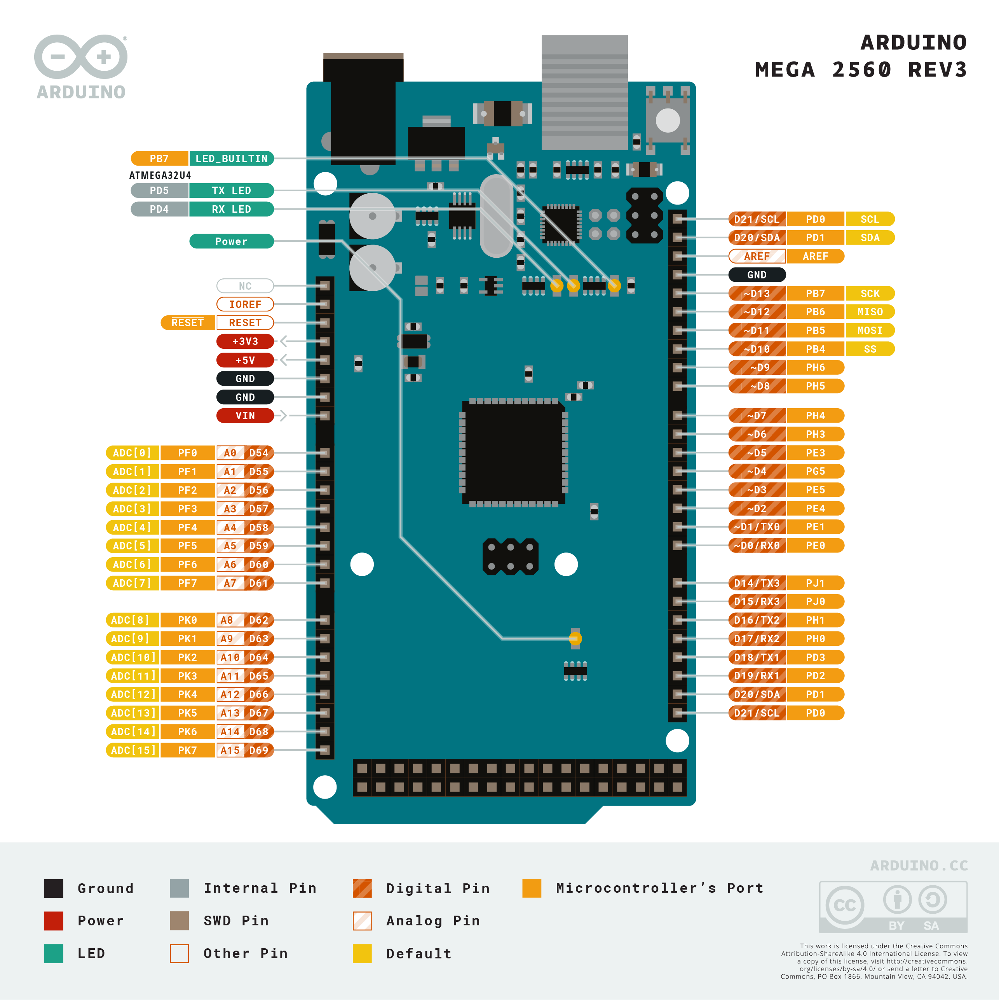
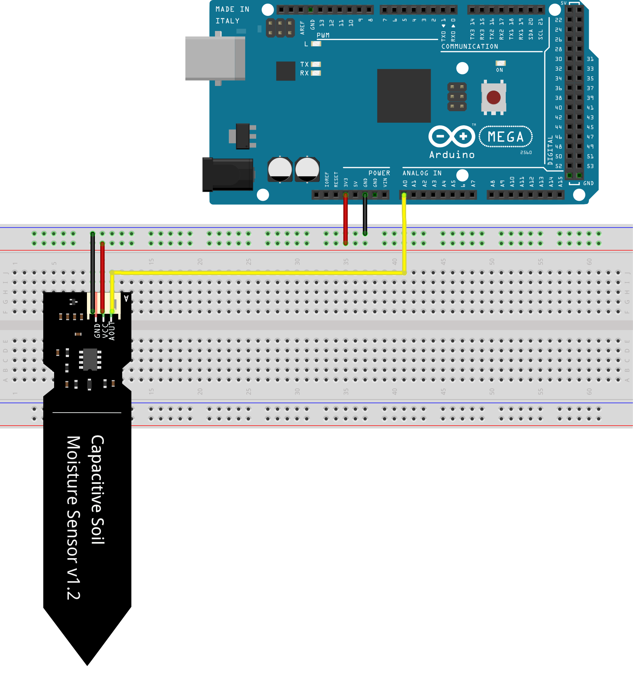
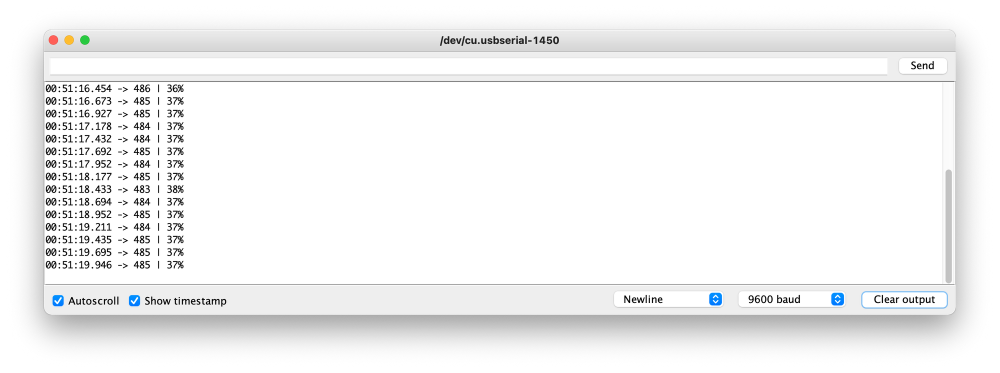

This tutorial will go over how to use a Capacitive Soil Moisture Sensor 🌱

<!-- truncate -->

## Supplies

- (1) Arduino Mega2560
- (1) Capacitive Soil Moisture Sensor

> For reference I have included the pinout diagram for the Arduino Mega2560



## Setup

Connecting the Capacitive Soil Moisture Sensor to the Mega2560 is as easy connecting:

1. GND -> GND
2. VCC -> 3.3v
3. AOUT -> A0



## Calibration

Capacitive Soil Moisture Sensors require calibration before use by doing the following;

1. Get the value when the sensor is exposed to the air
2. Get the value when the sensor is in water

```cpp
void setup() {
   Serial.begin(9600); // open serial port, set the baud rate to 9600 bps
}

void loop() {
   Serial.println(analogRead(A0));
   delay(250);
}
```

## Code

Once you get the numbers from the calibration, put those numbers as the defaults for *AirValue*and _WaterValue._

```cpp showLineNumbers
 const int AirValue = ?;   // This is the value of your sensor when you place it in the open air
 const int WaterValue = ?;  // This is the value when you place your sensor in a glass of water

 int value = 0;
 int percent = 0;

 void setup() {
   Serial.begin(9600); // open serial port, set the baud rate to 9600 bps
 }

 void loop() {
   value = analogRead(A0);

   percent = map(value, AirValue, WaterValue, 0, 100);

   if (percent > 100) {
     Serial.print(value);
     Serial.print(" | ");
     Serial.println("100 %");
   } else if (percent < 0) {
     Serial.print(value);
     Serial.print(" | ");
     Serial.println("0 %");
   } else if (percent > 0 && percent < 100) {
     Serial.print(value);
     Serial.print(" | ");
     Serial.print(percent);
     Serial.println("%");
   }
   delay(250);
 }
```

## Result

After that, uploading the following code to your Arduino mega2560 and opening up the terminal, you should see the following:


