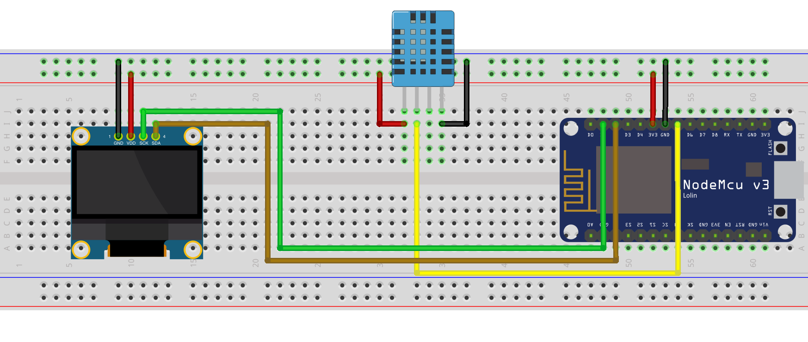

This tutorial goes over how to use the following to make a functioning weather station! 🌦

## Supplies

- (1) ESP8266 Wi-Fi Microcontroller (NodeMCU v3)
- (1) 0.96 " OLED 1306
- (1) DHT11
- (8) Jumper wires

<!-- truncate -->

> For reference I have included the pinout diagram for the ESP8266 Wi-Fi Microcontroller (NodeMCU v3) that I am using.


## Setup



## Code

For this project, we are using the following libraries:

1. Adafruit_GFX
2. Adafruit_SSD1306
3. Adafruit_Sensor

> For information on how to install the libraries above please visit [https://www.arduino.cc/en/guide/libraries](https://www.arduino.cc/en/guide/libraries).

```cpp
 #include <Wire.h>
 #include <Adafruit_GFX.h>
 #include <Adafruit_SSD1306.h>
 #include <Adafruit_Sensor.h>
 #include <DHT.h>

 #define SCREEN_WIDTH 128 // OLED display width, in pixels
 #define SCREEN_HEIGHT 64 // OLED display height, in pixels

 // Declaration for an SSD1306 display connected to I2C (SDA, SCL pins)
 Adafruit_SSD1306 display(SCREEN_WIDTH, SCREEN_HEIGHT, &Wire, -1);

 #define DHTPIN 14     // Digital pin connected to the DHT sensor

 DHT dht(DHTPIN, DHT11);

 void setup() {
   Serial.begin(115200);

   dht.begin();

   if (!display.begin(SSD1306_SWITCHCAPVCC, 0x3C)) {
     Serial.println(F("SSD1306 allocation failed"));
     for (;;);
   }
   delay(2000);
   display.clearDisplay();
   display.setTextColor(WHITE);
 }

 void loop() {
   delay(5000);

   //read temperature and humidity
   float t = dht.readTemperature();
   float h = dht.readHumidity();

   // clear display
   display.clearDisplay();

   if (isnan(h) || isnan(t)) {
     // display error message
     Serial.println("Failed to read from DHT sensor!");
     display.setCursor(0, 0);
     display.setTextSize(1);
     display.print("Failed to read from DHT sensor!");
   } else {
     // display temperature
     display.setTextSize(1);
     display.setCursor(0, 0);
     display.print("Temperature: ");
     display.setTextSize(2);
     display.setCursor(0, 10);
     display.print(t);
     display.print(" ");
     display.setTextSize(1);
     display.cp437(true);
     display.write(167);
     display.setTextSize(2);
     display.print("C");

     // display humidity
     display.setTextSize(1);
     display.setCursor(0, 35);
     display.print("Humidity: ");
     display.setTextSize(2);
     display.setCursor(0, 45);
     display.print(h);
     display.print(" %");
   }

   display.display();
 }
```

If all the parts are working accordingly, you will see the following for having a DHT11 sensor and when you don't.


States of being able to read the DHT11 sensor data.

> If you want to display the output as Fahrenheit all you need to do is change `dht.readTemperature();` to `dht.readTemperature(true);`. Changing the following and changing `display.print("C");` to `display.print("F");` will yeild the following results.


