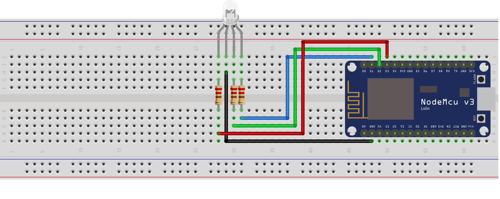

This tutorial goes over how to control an RGB LED with an Arduino ESP8266 🚦

## Supplies

- (1) LED - RGB Diffused Common Cathode
- (3) Resistor 220 ohm
- (4) Jumper wires
- (1) ESP8266 Wi-Fi Microcontroller (NodeMCU v3)

<!-- truncate -->

> For refrence I have included the pinout diagram for the ESP8266 Wi-Fi Microcontroller (NodeMCU v3) that I am using.


## Setup



## Code

> This project does not require any additional libraries. The Arduino standard lib is enough.

```cpp showLineNumbers
int red_light = 0;
int green_light = 4;
int blue_light = 5;

void setup() {
  pinMode(red_light, OUTPUT);
  pinMode(green_light, OUTPUT);
  pinMode(blue_light, OUTPUT);
}

void loop() {
  RGB_color(255, 0, 0); // Red
  delay(1000);
  RGB_color(0, 255, 0); // Green
  delay(1000);
  RGB_color(0, 0, 255); // Blue
  delay(1000);
  RGB_color(255, 255, 125); // Raspberry
  delay(1000);
  RGB_color(0, 255, 255); // Cyan
  delay(1000);
  RGB_color(255, 0, 255); // Magenta
  delay(1000);
  RGB_color(255, 255, 0); // Yellow
  delay(1000);
  RGB_color(255, 255, 255); // White
  delay(1000);
}

void RGB_color(int red_light_value, int green_light_value, int blue_light_value) {
  analogWrite(red_light, red_light_value);
  analogWrite(green_light, green_light_value);
  analogWrite(blue_light, blue_light_value);
}
```


