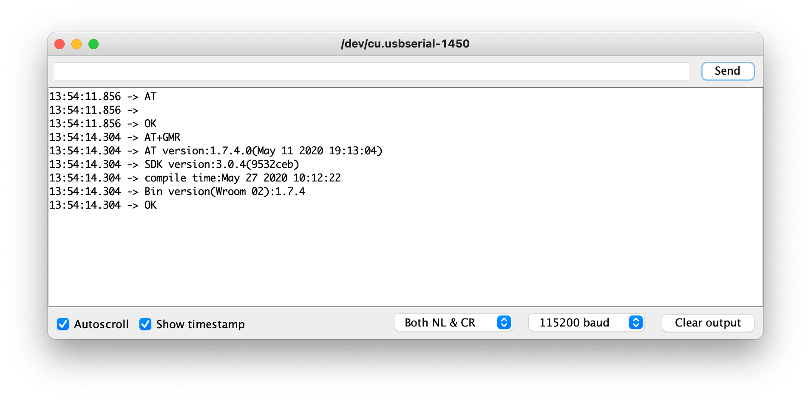
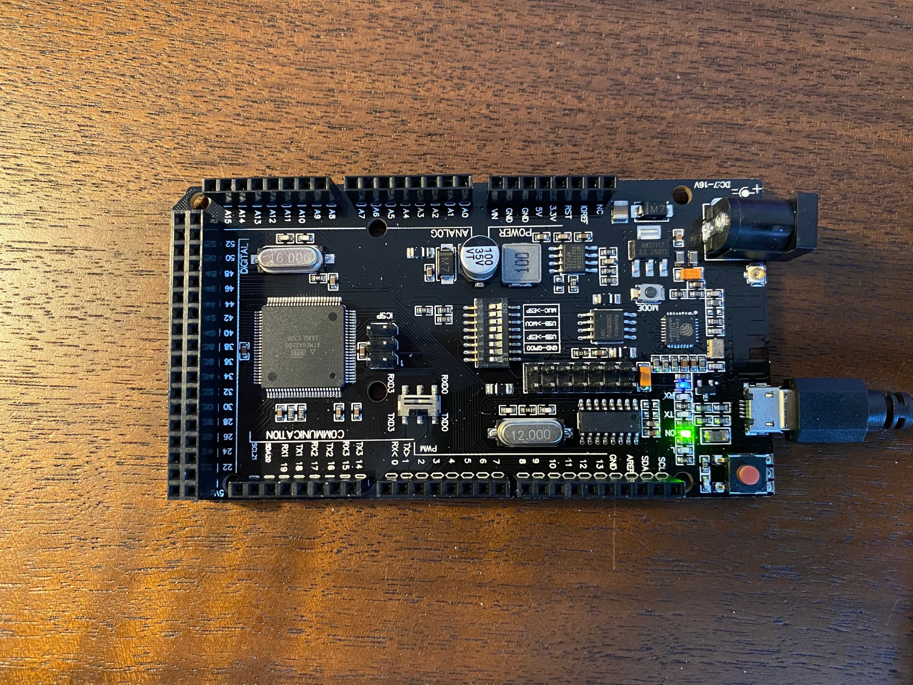
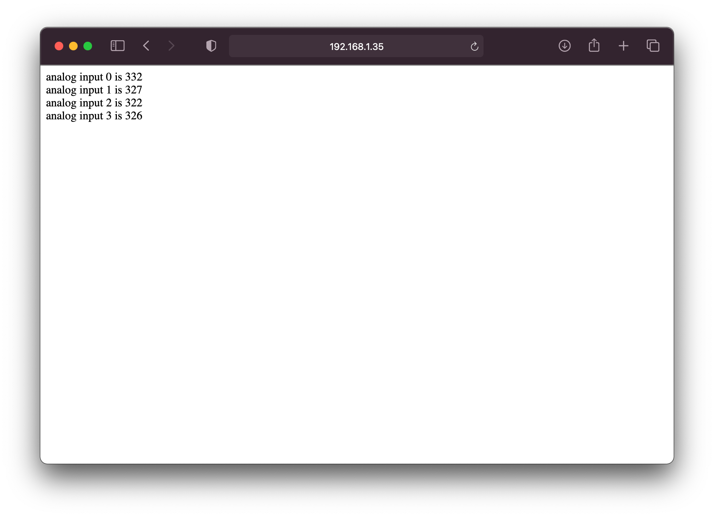
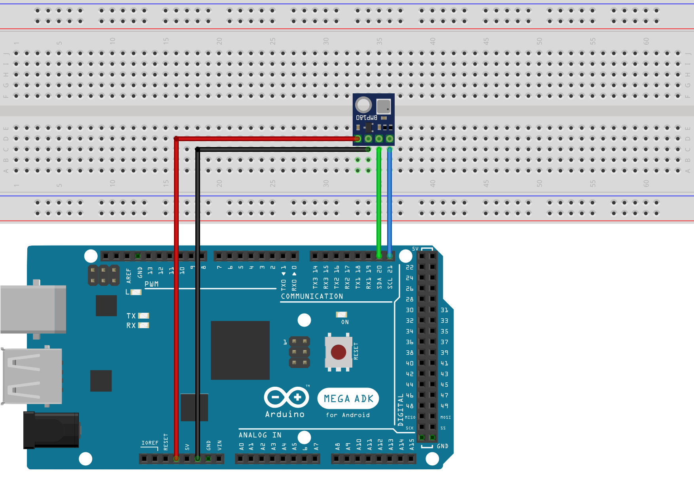
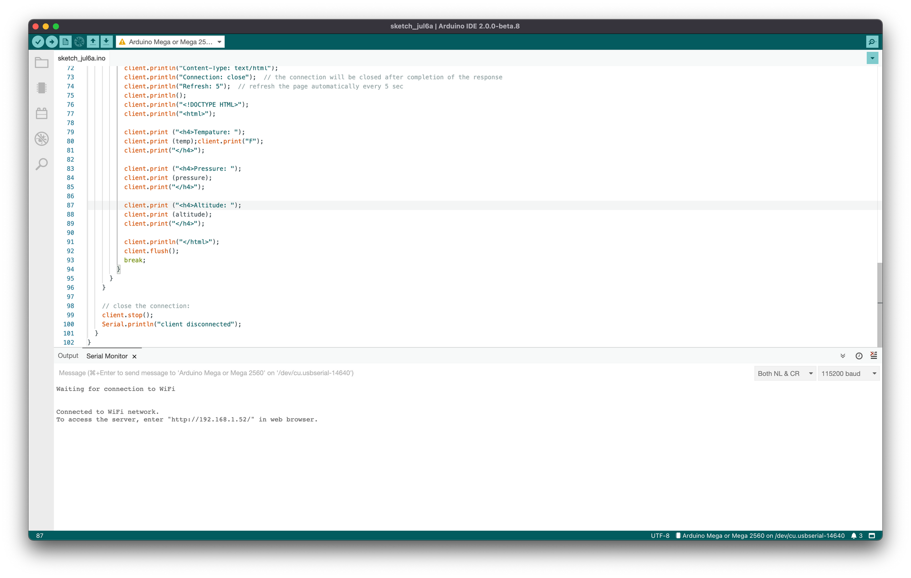

This tutorial goes over how to use the Mega 2560 R3 built-in ESP8266 and create a web server by flashing the onboard ESP8266 with AT firmware which only requires programming the ATmega2560. 📶

## Supplies

- [Mega 2560 R3 with built-in ESP8266](https://www.banggood.com/Geekcreit-Mega-WiFi-R3-Module-ATmega2560ESP8266-32Mb-Memory-USB-TTL-CH340G-p-1205437.html?rmmds=search&cur_warehouse=CN)

<!-- truncate -->

This board has a lot of spotty information circulating the internet. It is important to know that this board contains two chips and because of that requires uploading two different programs to each of the chips. The onboard ESP8266 has 4MiB of flash memory, and the ATmega2560 has 256kb. For my use cases, I wanted to take advantage of only having to upload my program to one chip. The way I accomplished this is by flashing the ESP8266 chip with AT firmware so that the ATmega2560 could communicate with it using the `Mega2560+ESP8266` DIP switch configuration that provides access via the onboard `Serial3` communication.

> The board is sold by multiple sellers and schematics can be found for it here <https://robotdyn.com/mega-wifi-r3-atmega2560-esp8266-flash-32mb-usb-ttl-ch340g-micro-usb.html>

The following chart represents the DIP switch configurations that can be used on the board. I will post the specific configurations that are used in the sections below. These DIP switches are not very durable, as they fall apart if they are switched frequently.

|                                                   | 1   | 2   | 3   | 4   | 5   | 6   | 7   | 8     |
| ------------------------------------------------- | --- | --- | --- | --- | --- | --- | --- | ----- |
| CH340 connect to ESP8266 (upload sketch)          | OFF | OFF | OFF | OFF | ON  | ON  | ON  | NoUSE |
| CH340 connect to ESP8266 (connect)                | OFF | OFF | OFF | OFF | ON  | ON  | OFF | NoUSE |
| CH340 connect to ATmega2560 (upload sketch)       | OFF | OFF | ON  | ON  | OFF | OFF | OFF | NoUSE |
| CH340 connect to Mega2560 COM3 connect to ESP8266 | ON  | ON  | ON  | ON  | OFF | OFF | OFF | NoUSE |
| Mega2560+ESP8266                                  | ON  | ON  | OFF | OFF | OFF | OFF | OFF | NoUSE |
| All modules work independently                    | OFF | OFF | OFF | OFF | OFF | OFF | OFF | NoUSE |

## Flashing AT firmware for onboard ESP8266

To flash the AT firmware, please ensure you have installed [esptool](https://github.com/espressif/esptool). Running the following command should show connected devices to identify which device should be targeted with esptool.

```bash
ls /dev/tty.*
# /dev/tty.Bluetooth-Incoming-Port /dev/tty.URT2
# /dev/tty.usbserial-1450         /dev/tty.URT1
```

Gets the list of devices connected to your Mac

> In order to flash the ESP8266 please ensure that you have the DIP switches in the follow locations.

|                                          | 1   | 2   | 3   | 4   | 5   | 6   | 7   | 8     |
| ---------------------------------------- | --- | --- | --- | --- | --- | --- | --- | ----- |
| CH340 connect to ESP8266 (upload sketch) | OFF | OFF | OFF | OFF | ON  | ON  | ON  | NoUSE |

If you have the mega2560 connected to power, please disconnected it and as you reconnect it back to power, please press the mode button. This procedure will make the ESP8266 goes into flashing mode.

Ensure that you download <https://github.com/espressif/ESP8266_NONOS_SDK/releases/tag/version_3.0.4> and cd into the extracted folder. This contains the AT firmware version 1.7.4.0.

> Ensure that if you have a serial monitor open for this device that you close it so that esptool can open up a connection with it.

```bash
esptool.py write_flash --flash_mode dio  --flash_size 2MB-c1 0x0 bin/boot_v1.7.bin 0x01000 bin/at/1024+1024/user1.2048.new.5.bin 0x1fb000 bin/blank.bin 0x1fc000 bin/esp_init_data_default_v08.bin 0xfe000 bin/blank.bin 0x1fe000 bin/blank.bin
```

Flash AT firmware to the onboard ESP8266v
After running the command above in the terminal, it should yield `Hard resetting via RTS pin...`. Once this is displayed in the terminal please disconnect the Arduino and set it to the following DIP switch configurations:

|                                    | 1   | 2   | 3   | 4   | 5   | 6   | 7   | 8     |
| ---------------------------------- | --- | --- | --- | --- | --- | --- | --- | ----- |
| CH340 connect to ESP8266 (connect) | OFF | OFF | OFF | OFF | ON  | ON  | OFF | NoUSE |

Opening up a serial monitor session with the device, you should see the following output when running the following commands:

1. AT (Tests the startup)
2. AT+GMR (Checks the version information)



> For more commands that AT can respond to, please visit <https://www.espressif.com/sites/default/files/documentation/4a-esp8266_at_instruction_set_en.pdf>.

## Creating Web Server

Now that we have the ESP8266 working with AT commands, we now only have to program mega2560 for future work. To program the mega2560, please set the following DIP switch configurations:

|                                             | 1   | 2   | 3   | 4   | 5   | 6   | 7   | 8     |
| ------------------------------------------- | --- | --- | --- | --- | --- | --- | --- | ----- |
| CH340 connect to ATmega2560 (upload sketch) | OFF | OFF | ON  | ON  | OFF | OFF | OFF | NoUSE |

We will need to install the `WiFiEspAT` library to make communicating with AT commands easier.

> _For information on how to install the libraries above please visist_[_https://www.arduino.cc/en/guide/libraries_](https://www.arduino.cc/en/guide/libraries)_._

Once you have done that, upload the following program through Arduino IDE. Please change `NAME_OF_SSID` and `PASSWORD_OF_SSID` to your network, you are currently connected to.

```cpp showLineNumber
 #include <WiFiEspAT.h>

 WiFiServer server(80);

 void setup() {

   Serial.begin(115200);
   while (!Serial);

   Serial3.begin(115200);
   WiFi.init(Serial3);

   if (WiFi.status() == WL_NO_MODULE) {
     Serial.println("Communication with WiFi module failed!");
     // don't continue
     while (true);
   }

   WiFi.begin(NAME_OF_SSID, PASSWORD_OF_SSID);
   Serial.println("Waiting for connection to WiFi");
   while (WiFi.status() != WL_CONNECTED) {
     delay(1000);
     Serial.print('.');
   }
   Serial.println();

   server.begin();

   IPAddress ip = WiFi.localIP();
   Serial.println();
   Serial.println("Connected to WiFi network.");
   Serial.print("To access the server, enter \"http://");
   Serial.print(ip);
   Serial.println("/\" in web browser.");
 }

 void loop() {

   WiFiClient client = server.available();
   if (client) {
     IPAddress ip = client.remoteIP();
     Serial.print("new client ");
     Serial.println(ip);

     while (client.connected()) {
       if (client.available()) {
         String line = client.readStringUntil('\n');
         line.trim();
         Serial.println(line);

         // if you've gotten to the end of the HTTP header (the line is blank),
         // the http request has ended, so you can send a reply
         if (line.length() == 0) {
           // send a standard http response header
           client.println("HTTP/1.1 200 OK");
           client.println("Content-Type: text/html");
           client.println("Connection: close");  // the connection will be closed after completion of the response
           client.println("Refresh: 5");  // refresh the page automatically every 5 sec
           client.println();
           client.println("<!DOCTYPE HTML>");
           client.println("<html>");
           // output the value of analog input pins
           for (int analogChannel = 0; analogChannel < 4; analogChannel++) {
             int sensorReading = analogRead(analogChannel);
             client.print("analog input ");
             client.print(analogChannel);
             client.print(" is ");
             client.print(sensorReading);
             client.println("<br />");
           }
           client.println("</html>");
           client.flush();
           break;
         }
       }
     }

     // close the connection:
     client.stop();
     Serial.println("client disconnected");
   }
 }
```

Once you have successfully uploaded the previous code to your mega2560, please set the DIP switches to the following positions.

|                  | 1   | 2   | 3   | 4   | 5   | 6   | 7   | 8     |
| ---------------- | --- | --- | --- | --- | --- | --- | --- | ----- |
| Mega2560+ESP8266 | ON  | ON  | ON  | ON  | OFF | OFF | OFF | NoUSE |

Lastly, you need to set the RX and TX switch to the RXD3 and TXD3. Please look at the following image to see the final configuration.



> As you can see the 3 and 4 pins are in the on position, this is needed to keep the Serial output passing to the USB so that the Serial Monitor would get printed values.




## Reading Sensor Data

For a more in-depth example of how to combine all the pieces of this post, we can read in sensor data and output it to a webpage like the following:


This example requires a `gy-21p`. For more info about this sensor please see [https://www.gabrielcsapo.com/arduino-gy-21p/](../2020-08-27-arduino-gy-21p/2020-08-27-arduino-gy-21p.md).

### Setup

We are utilizing the i2c ports in this example to interface with the gy-21p sensor. In the case of the mega2560, this is ports 20 and 21.



### Code

We are using the following libraries for this example:

- Adafruit_BMP280
- WiFiEspAT

> **For information on how to install the libraries above please visist**[**_https://www.arduino.cc/en/guide/libraries_**](https://www.arduino.cc/en/guide/libraries)**.**

```cpp showLineNumber
  #define NAME_OF_SSID "x"
  #define PASSWORD_OF_SSID  "x"

  #include <Adafruit_BMP280.h>
  #include <WiFiEspAT.h>

  Adafruit_BMP280 bme;

  WiFiServer server(80);

  void setup() {

    Serial.begin(115200);
    while (!Serial);

    if (!bme.begin(0x76)) // depending on the chip you have the i2c address is either 0x77 or 0x77
    {
      Serial.println("Could not find a valid BMP280 sensor, check wiring!");
      while (1);
    }

    Serial3.begin(115200);
    WiFi.init(Serial3);

    if (WiFi.status() == WL_NO_MODULE) {
      Serial.println("Communication with WiFi module failed!");
      // don't continue
      while (true);
    }

    WiFi.begin(NAME_OF_SSID, PASSWORD_OF_SSID);
    Serial.println("Waiting for connection to WiFi");
    while (WiFi.status() != WL_CONNECTED) {
      delay(1000);
      Serial.print('.');
    }
    Serial.println();

    server.begin();

    IPAddress ip = WiFi.localIP();
    Serial.println();
    Serial.println("Connected to WiFi network.");
    Serial.print("To access the server, enter \"http://");
    Serial.print(ip);
    Serial.println("/\" in web browser.");
  }

  void loop() {
    float temp = (bme.readTemperature() * 1.8) + 32;
    float pressure = bme.readPressure();
    float altitude = bme.readAltitude(1010);

    WiFiClient client = server.available();

    if (client) {
      IPAddress ip = client.remoteIP();
      Serial.print("new client ");
      Serial.println(ip);

      while (client.connected()) {
        if (client.available()) {
          String line = client.readStringUntil('\n');
          line.trim();
          Serial.println(line);

          // if you've gotten to the end of the HTTP header (the line is blank),
          // the http request has ended, so you can send a reply
          if (line.length() == 0) {
            // send a standard http response header
            client.println("HTTP/1.1 200 OK");
            client.println("Content-Type: text/html");
            client.println("Connection: close");  // the connection will be closed after completion of the response
            client.println("Refresh: 5");  // refresh the page automatically every 5 sec
            client.println();
            client.println("<!DOCTYPE HTML>");
            client.println("<html>");

            client.print ("<h4>Tempature: ");
            client.print (temp);client.print("F");
            client.print("</h4>");

            client.print ("<h4>Pressure: ");
            client.print (pressure);
            client.print("</h4>");

            client.print ("<h4>Altitude: ");
            client.print (altitude);
            client.print("</h4>");

            client.println("</html>");
            client.flush();
            break;
          }
        }
      }

      // close the connection:
      client.stop();
      Serial.println("client disconnected");
    }
  }
```

> Please ensure you change the values for `NAME_OF_SSID` and `PASSWORD_OF_SSID` as these are required to connect to your local wifi.

Once you have uploaded the above sketch your Serial Monitor output should show an IP address to navigate to see the output of the gy-21p sensor data!


