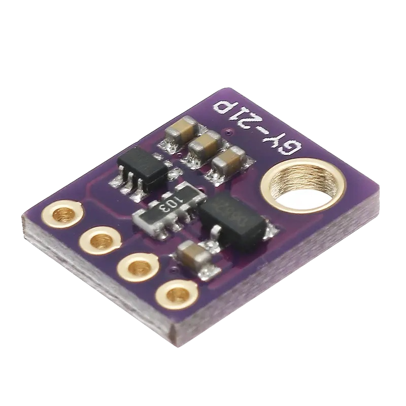

This tutorial goes over how to use the Arduino ESP8266 to visualize; temperature, humidity, barometric pressure, and altitude retrieved from the GYP-21P. ☁️

## Supplies

- Arduino ESP2866
- SSD1306 0.96" Screen
- GYP-21P

<!-- truncate -->



The GY-21P combines a BMP280 Sensor and an S17021 Sensor. Meaning this chip can tell; temperature, humidity, pressure, and altitude.

**_BMP280 (Barometric Pressure & Altitude Sensor)_**
TraitDescriptionCommunications InterfaceI2C & SPIPressure range300-1100 hPa (9000 meters above sea level at -500m)Relative accuracy(at 950 – 1050 hPa at 25 ° C): ± 0.12 hPa, Equiv. to ± 1 mAbsolute accuracy(at (950 – 1050 hPa, 0 – +40 ° C): ± 0.12 hPa, Equiv. To ± 1 mOperation Voltage1.8V – 3.6VPower consumption2.7µA at 1Hz readout rateTemperature range-40 to + 85 ° C
**_SI7021 (Temperature & Humidity Sensor)_**
TraitDescriptionCommunications InterfaceI2C & SPIOperation Voltage3.3VTempature Range-40 to 85 ° CHumidity Range0 – 100% RH, =-3% from 20-80%Pressure Range30,000Pa to 110,000Pa, relative accuracy of 12Pa, absolute accuracy of 100PaAltitude Range0 to 30,000 ft (9.2 km), relative accuracy of 3.3 ft (1 m) at sea level, 6.6 (2 m) at 30,000 ft

> _For refrence I have included the pinout diagram for the ESP8266 Wi-Fi Microcontroller (NodeMCU v3) that I am using._


## Setup


## **Code**

For this project, we are using the following libraries:

1. Adafruit_Sensor
2. Adafruit_GFX
3. Adafruit_SSD1306
4. Adafruit_BMP280
5. Adafruit_Si7021

> _For information on how to install the libraries above please visist _[_https://www.arduino.cc/en/guide/libraries_](https://www.arduino.cc/en/guide/libraries)_._

```cpp showLineNumbers
 #include <Wire.h>
 #include <Adafruit_Sensor.h>
 #include <Adafruit_GFX.h>
 #include <Adafruit_SSD1306.h>
 #include <Adafruit_BMP280.h>
 #include "Adafruit_Si7021.h"

 #define SCREEN_WIDTH 128
 #define SCREEN_HEIGHT 64

 Adafruit_SSD1306 display(SCREEN_WIDTH, SCREEN_HEIGHT, &Wire, -1);

 Adafruit_BMP280 bme; // I2C
 Adafruit_Si7021 si7021 = Adafruit_Si7021();

 void setup()
 {
   Serial.begin(115200);

   if (!bme.begin(0x76)) // depending on the chip you have the i2c address is either 0x77 or 0x77
   {
     Serial.println("Could not find a valid BMP280 sensor, check wiring!");
     while (1);
   }

   if (!si7021.begin())
   {
     Serial.println("Did not find Si7021 sensor!");
     while (true);
   }

   if (!display.begin(SSD1306_SWITCHCAPVCC, 0x3C)) {
     Serial.println(F("SSD1306 allocation failed"));
     for (;;);
   }

   display.clearDisplay();
   display.setTextColor(WHITE);
 }

 void loop() {
   delay(5000);

   display.clearDisplay();

   display.setTextSize(.75);
   display.setCursor(0, 0);
   display.print("Temp / Humidity: ");
   display.setCursor(0, 10);
   display.print((bme.readTemperature() * 1.8) + 32);
   display.print(" ");
   display.cp437(true);
   display.write(167);
   display.print("F");
   display.print(" / ");
   display.print(si7021.readHumidity());
   display.print("%");

   display.setCursor(0, 20);
   display.print("Pressure: ");
   display.setCursor(0, 30);
   display.print(bme.readPressure());
   display.print(" ");
   display.print("Pa");

   display.setCursor(0, 40);
   display.print("Approx altitude: ");
   display.setCursor(0, 50);
   display.print(bme.readAltitude(1010)); // this should be adjusted to your local air pressure at your current location.
   display.print(" ");
   display.print("m");

   display.display();
 }
```
