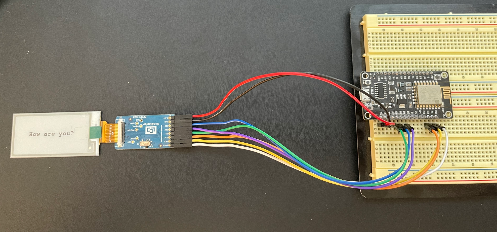

This tutorial goes over how to use the GDEW0213T5 💨!

## Supplies

- (1) Good Display (e-paper)
- (1) Good Display DESPI-CO2
- (4) Jumper wires
- (1) ESP8266 Wi-Fi Microcontroller (NodeMCU v3)

<!-- truncate -->

> _For refrence I have included the pinout diagram for the ESP8266 Wi-Fi Microcontroller (NodeMCU v3) that I am using._


> I just wanted to start off this post with a huge shout-out to <https://github.com/ZinggJM>. A lot of the Arduino community is powered by everyday people making other people's lives easier. ZinggJM has made working with e-paper displays amazingly easy, thank you for everything you do!

## Setup

> I am currently trying to make a fritzing part for the DESPI-C02. Until I do that I have shown the setup as a picture instead.

 Setup for the display.

> BUSY -> D0, RES -> D1, D/C -> D2, CS -> D8, SCK -> D5, SDI -> D7, GND -> GND, 3.3V -> 3V (Be sure to set the resistance to 0.47 for this display)

## Code

For this project, we are using the following libraries:

1. Adafruit_GFX
2. GxEPD2

```cpp showLineNumbers
#include <GxEPD2_BW.h>
#include <GxEPD2_3C.h>
#include <Fonts/FreeMonoBold9pt7b.h>

GxEPD2*BW<GxEPD2_213_M21, GxEPD2_213_M21::HEIGHT> display(GxEPD2_213_M21(/\_CS=15*/ SS, /_DC=4_/ 4, /_RST=5_/ 5, /_BUSY=16_/ 16)); // GDEW0213M21

void setup() {
   display.init(115200);
   helloWorld();
   display.hibernate();
}

const char HelloWorld[] = "How are you?";

void helloWorld() {
  display.setRotation(1);
  display.setFont(&FreeMonoBold9pt7b);
  display.setTextColor(GxEPD_BLACK);
  int16_t tbx, tby; uint16_t tbw, tbh;
  display.getTextBounds(HelloWorld, 0, 0, &tbx, &tby, &tbw, &tbh);
  // center the bounding box by transposition of the origin:
  uint16_t x = ((display.width() - tbw) / 2) - tbx;
  uint16_t y = ((display.height() - tbh) / 2) - tby;
  display.setFullWindow();
  display.firstPage();

  do {
    display.fillScreen(GxEPD_WHITE);
    display.setCursor(x, y);
    display.print(HelloWorld);
  } while (display.nextPage());
}

void loop() {};
```

Once you have uploaded the sketch, you should see the screen result in the following output!


Text is cool, but so are images!

I took the heart picture below and ran it through [http://javl.github.io/image2cpp/](http://javl.github.io/image2cpp/) (ensure you click the options for a transparent background and invert colors) to get a bitmap.


```cpp
// 'heart', 50x44px
const unsigned char heart [] PROGMEM = {
0x00, 0x0c, 0x00, 0x00, 0x0e, 0x00, 0x00, 0x01, 0xff, 0xc0, 0x01, 0xff, 0xe0, 0x00, 0x07, 0xff,
0xf0, 0x07, 0xff, 0xf8, 0x00, 0x1f, 0xff, 0xfc, 0x0f, 0xff, 0xfc, 0x00, 0x3f, 0xff, 0xfe, 0x1f,
0xff, 0xfe, 0x00, 0x3f, 0xff, 0xff, 0x3f, 0xff, 0xff, 0x00, 0x7f, 0xff, 0xff, 0x3f, 0xff, 0xff,
0x80, 0x7f, 0xff, 0xff, 0xff, 0xff, 0xff, 0x80, 0xff, 0xff, 0xff, 0xff, 0xff, 0xff, 0xc0, 0xff,
0xff, 0xff, 0xff, 0xff, 0xff, 0xc0, 0xff, 0xff, 0xff, 0xff, 0xff, 0xff, 0xc0, 0xff, 0xff, 0xff,
0xff, 0xff, 0xff, 0xc0, 0xff, 0xff, 0xff, 0xff, 0xff, 0xff, 0xc0, 0xff, 0xff, 0xff, 0xff, 0xff,
0xff, 0xc0, 0xff, 0xff, 0xff, 0xff, 0xff, 0xff, 0xc0, 0xff, 0xff, 0xff, 0xff, 0xff, 0xff, 0xc0,
0xff, 0xff, 0xff, 0xff, 0xff, 0xff, 0xc0, 0xff, 0xff, 0xff, 0xff, 0xff, 0xff, 0xc0, 0x7f, 0xff,
0xff, 0xff, 0xff, 0xff, 0x80, 0x7f, 0xff, 0xff, 0xff, 0xff, 0xff, 0x80, 0x3f, 0xff, 0xff, 0xff,
0xff, 0xff, 0x00, 0x3f, 0xff, 0xff, 0xff, 0xff, 0xff, 0x00, 0x1f, 0xff, 0xff, 0xff, 0xff, 0xfe,
0x00, 0x0f, 0xff, 0xff, 0xff, 0xff, 0xfe, 0x00, 0x0f, 0xff, 0xff, 0xff, 0xff, 0xfc, 0x00, 0x07,
0xff, 0xff, 0xff, 0xff, 0xf8, 0x00, 0x03, 0xff, 0xff, 0xff, 0xff, 0xf8, 0x00, 0x03, 0xff, 0xff,
0xff, 0xff, 0xf0, 0x00, 0x01, 0xff, 0xff, 0xff, 0xff, 0xe0, 0x00, 0x00, 0xff, 0xff, 0xff, 0xff,
0xc0, 0x00, 0x00, 0x7f, 0xff, 0xff, 0xff, 0x80, 0x00, 0x00, 0x3f, 0xff, 0xff, 0xff, 0x00, 0x00,
0x00, 0x1f, 0xff, 0xff, 0xfe, 0x00, 0x00, 0x00, 0x0f, 0xff, 0xff, 0xfc, 0x00, 0x00, 0x00, 0x07,
0xff, 0xff, 0xf8, 0x00, 0x00, 0x00, 0x03, 0xff, 0xff, 0xf0, 0x00, 0x00, 0x00, 0x01, 0xff, 0xff,
0xe0, 0x00, 0x00, 0x00, 0x00, 0x7f, 0xff, 0xc0, 0x00, 0x00, 0x00, 0x00, 0x3f, 0xff, 0x80, 0x00,
0x00, 0x00, 0x00, 0x1f, 0xfe, 0x00, 0x00, 0x00, 0x00, 0x00, 0x0f, 0xfc, 0x00, 0x00, 0x00, 0x00,
0x00, 0x07, 0xf8, 0x00, 0x00, 0x00, 0x00, 0x00, 0x03, 0xf0, 0x00, 0x00, 0x00, 0x00, 0x00, 0x01,
0xe0, 0x00, 0x00, 0x00
};
```

Once I got this, I started to play around with the alignment of the bitmap and the text and settled on the following code snippet.

```cpp showLineNumbers
 #include <GxEPD2_BW.h>
 #include <GxEPD2_3C.h>
 #include <Fonts/FreeMonoBold9pt7b.h>

 GxEPD2_BW<GxEPD2_213_M21, GxEPD2_213_M21::HEIGHT> display(GxEPD2_213_M21(/*CS=15*/ SS, /*DC=4*/ 4, /*RST=5*/ 5, /*BUSY=16*/ 16)); // GDEW0213M21

 // 'heart', 50x44px
 const unsigned char heart [] PROGMEM = {
  0x00, 0x0c, 0x00, 0x00, 0x0e, 0x00, 0x00, 0x01, 0xff, 0xc0, 0x01, 0xff, 0xe0, 0x00, 0x07, 0xff,
  0xf0, 0x07, 0xff, 0xf8, 0x00, 0x1f, 0xff, 0xfc, 0x0f, 0xff, 0xfc, 0x00, 0x3f, 0xff, 0xfe, 0x1f,
  0xff, 0xfe, 0x00, 0x3f, 0xff, 0xff, 0x3f, 0xff, 0xff, 0x00, 0x7f, 0xff, 0xff, 0x3f, 0xff, 0xff,
  0x80, 0x7f, 0xff, 0xff, 0xff, 0xff, 0xff, 0x80, 0xff, 0xff, 0xff, 0xff, 0xff, 0xff, 0xc0, 0xff,
  0xff, 0xff, 0xff, 0xff, 0xff, 0xc0, 0xff, 0xff, 0xff, 0xff, 0xff, 0xff, 0xc0, 0xff, 0xff, 0xff,
  0xff, 0xff, 0xff, 0xc0, 0xff, 0xff, 0xff, 0xff, 0xff, 0xff, 0xc0, 0xff, 0xff, 0xff, 0xff, 0xff,
  0xff, 0xc0, 0xff, 0xff, 0xff, 0xff, 0xff, 0xff, 0xc0, 0xff, 0xff, 0xff, 0xff, 0xff, 0xff, 0xc0,
  0xff, 0xff, 0xff, 0xff, 0xff, 0xff, 0xc0, 0xff, 0xff, 0xff, 0xff, 0xff, 0xff, 0xc0, 0x7f, 0xff,
  0xff, 0xff, 0xff, 0xff, 0x80, 0x7f, 0xff, 0xff, 0xff, 0xff, 0xff, 0x80, 0x3f, 0xff, 0xff, 0xff,
  0xff, 0xff, 0x00, 0x3f, 0xff, 0xff, 0xff, 0xff, 0xff, 0x00, 0x1f, 0xff, 0xff, 0xff, 0xff, 0xfe,
  0x00, 0x0f, 0xff, 0xff, 0xff, 0xff, 0xfe, 0x00, 0x0f, 0xff, 0xff, 0xff, 0xff, 0xfc, 0x00, 0x07,
  0xff, 0xff, 0xff, 0xff, 0xf8, 0x00, 0x03, 0xff, 0xff, 0xff, 0xff, 0xf8, 0x00, 0x03, 0xff, 0xff,
  0xff, 0xff, 0xf0, 0x00, 0x01, 0xff, 0xff, 0xff, 0xff, 0xe0, 0x00, 0x00, 0xff, 0xff, 0xff, 0xff,
  0xc0, 0x00, 0x00, 0x7f, 0xff, 0xff, 0xff, 0x80, 0x00, 0x00, 0x3f, 0xff, 0xff, 0xff, 0x00, 0x00,
  0x00, 0x1f, 0xff, 0xff, 0xfe, 0x00, 0x00, 0x00, 0x0f, 0xff, 0xff, 0xfc, 0x00, 0x00, 0x00, 0x07,
  0xff, 0xff, 0xf8, 0x00, 0x00, 0x00, 0x03, 0xff, 0xff, 0xf0, 0x00, 0x00, 0x00, 0x01, 0xff, 0xff,
  0xe0, 0x00, 0x00, 0x00, 0x00, 0x7f, 0xff, 0xc0, 0x00, 0x00, 0x00, 0x00, 0x3f, 0xff, 0x80, 0x00,
  0x00, 0x00, 0x00, 0x1f, 0xfe, 0x00, 0x00, 0x00, 0x00, 0x00, 0x0f, 0xfc, 0x00, 0x00, 0x00, 0x00,
  0x00, 0x07, 0xf8, 0x00, 0x00, 0x00, 0x00, 0x00, 0x03, 0xf0, 0x00, 0x00, 0x00, 0x00, 0x00, 0x01,
  0xe0, 0x00, 0x00, 0x00
 };

 void setup()
 {
   display.init(115200);
   helloWorld();
   display.hibernate();
 }

 const char HelloWorld[] = "Hello";

 void helloWorld()
 {
   display.setRotation(1);
   display.setFont(&FreeMonoBold9pt7b);
   display.setTextColor(GxEPD_BLACK);
   int16_t tbx, tby;
   uint16_t tbw, tbh;
   display.getTextBounds(HelloWorld, 0, 0, &tbx, &tby, &tbw, &tbh);
   // center the bounding box by transposition of the origin:
   uint16_t x = ((display.width() - tbw) / 2) - tbx;
   uint16_t y = ((display.height() - tbh) / 2) - tby;
   display.setFullWindow();
   display.firstPage();
   do
   {
     display.fillScreen(GxEPD_WHITE);
     display.setCursor(x - 25, y);
     display.print(HelloWorld);
     display.drawBitmap(tbw + 75, y - 25, heart, 50, 44, GxEPD_BLACK);
   } while (display.nextPage());
 }

 void loop(){};
```

Once I uploaded that to the esp8266, I got the text and bitmap to render out in the center of the screen!


Both of the examples in this post can be found as sketches at <https://github.com/gabrielcsapo/gabrielcsapo.com/tree/main/arduino-e-ink-good-display-gdew0213t5/sketch>!
