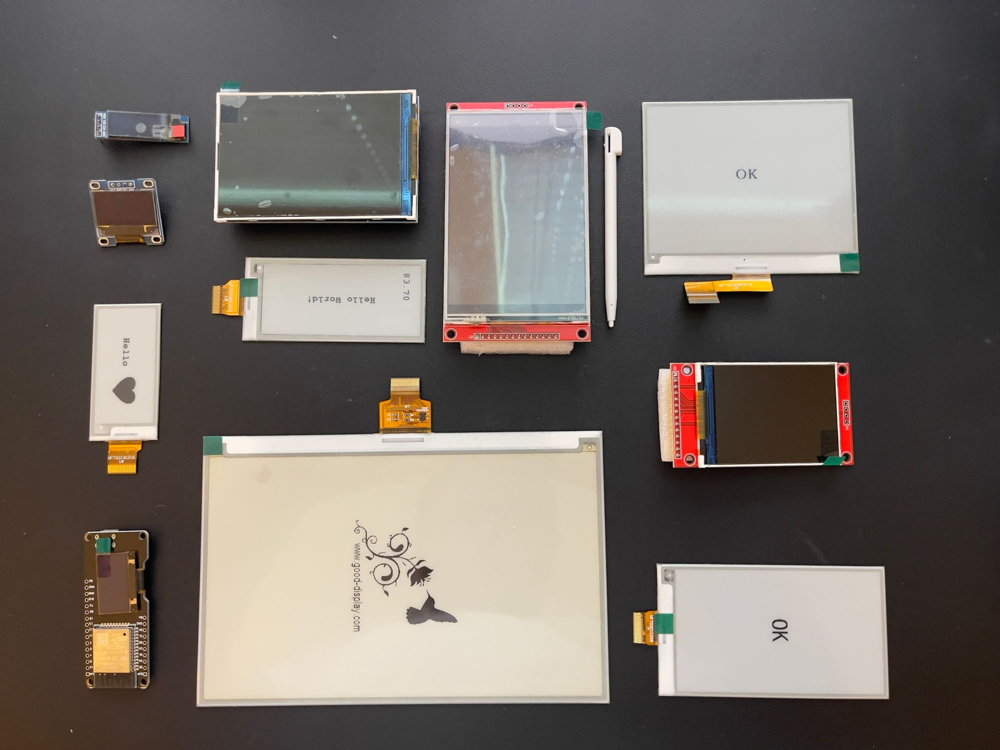
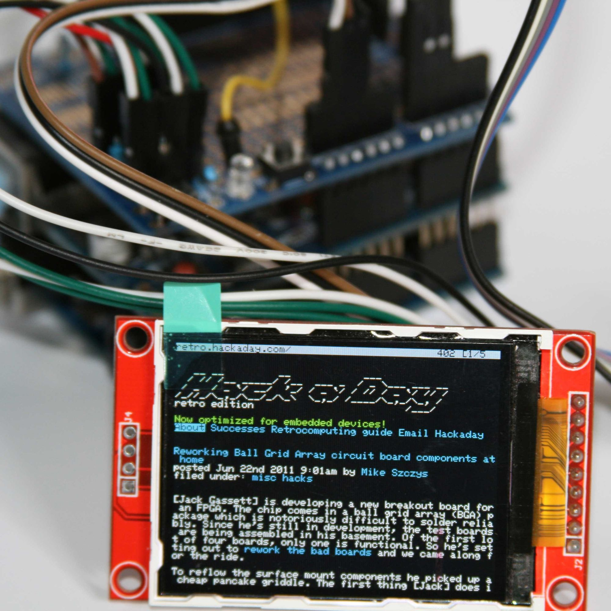

Over the last few months, I have been struggling to add a visual component to my hardware projects. I thought it might be the screen technology, so I bought e-ink displays, touchscreen TFTs, smaller screens, big screens, integrated screens. Everything I could think of to figure out what was missing from my project, and every time I ran into the same problem, UI.

<!-- truncate -->

## What are the gaps?

Building an app for phones, you have Android Studio or XCode, and for websites, you have the ever-multiplying number of ways to build and structure your site. For Arduino, you have a handful of libraries you can piece together but no cohesive story about structuring or building applications.

> The one thing that I have come by so far that kind of hits all the marks is <https://lvgl.io/developers> ([https://github.com/lvgl/lvgl](https://github.com/lvgl/lvgl)). I haven't seen a good set of demos for the cards that I am using so that might be something I look into trying to write about in the future.

I recently wrote an article about writing a webserver with the esp32 ([https://www.gabrielcsapo.com/arduino-web-server-esp-32/](../2021-04-25-arduino-web-server-esp-32/2021-04-25-arduino-web-server-esp-32.md)), and I started to think more and more about how easy it was to write a website and how if I could get a display to show a web browser, it might be exactly what I was missing. While it would be great to have a native UI for performance, it would be even better if I could have more flexibility in the actual surface of my projects.

## Why web?

Alright, hear me out. I know I am biased. I work on websites for a living, but here are some things you get out of the box with web technologies;

- **Remote experience**: You could have an in-context display of your project that would show you the most relevant glanceable information such as temperature or progress indicators and when navigating to the same device via a browser on another device, such as your phone, tablet, or laptop, you could get an expanded view of more information such as history, diagnostics, syncing or anything else.
- **Project Structure**: With the ever-evolving web frameworks, you can pick and choose the one that works with your programing style or space requirements.
- **Flexible UI**: Want a Material UI-looking project? Cool, you can do that right away. Want something that is more futuristic and has floating bubbles for navigation? You got it. Instead of mucking around with coordinates on a 2d plane, you can focus on the user interface and let the technology work for you. Want a way to render different experiences at certain viewport sizes? This works out of the box!
- **Out of the box API**: Since your UI will be rendered out of the main event loop, it will require a way to query the state of what is happening on the device. The way this is done is to represent your data as restful or GraphQL (I have yet to find a library that makes serving a GraphQL engine on any Arduino) endpoints that your UI can query to get that state.

So using web technologies on embedded projects gives you a lot out of the box, but getting the full experience on Arduino is not something I have been able to do.

I can serve web pages for remote clients easily, this works out of the box, but in terms of the in-person interactions with UI, the fallback is drawing lines on TFT screens.

## Filling the gap?

Really the only gap is the ability to run a browser experience with an Arduino and any screen (e.g., TFT, touch screen, e-ink). A way to possibly fill the gap is to have a Raspberry Pi Zero (or any device that renders a web page) that can boot directly to a browser, but this drastically increases the cost of any project and introduces another layer of failure. Building a smart lamp that shows the light intensity or pot that shows you the soil moisture levels shouldn't require another device to have a good in-person experience.

Having a lightweight web renderer would be great for Arduino. In my searches, the only thing that tries to handle this is [https://github.com/zigwart/PIP-Arduino-Web-Browser](https://github.com/zigwart/PIP-Arduino-Web-Browser) which will parse web pages and render out text.

Sadly this project hasn't been worked on since 2014 since writing this in 2021. Chrome has an embeddable version called CEF or Chromium Embedded Framework ([https://bitbucket.org/chromiumembedded/cef/src/master/](https://bitbucket.org/chromiumembedded/cef/src/master/)). Webkit also has an embedded variant ([https://webkit.org/wpe/](https://webkit.org/wpe/)) which might be a great candidate. A lot of this requires a raspberry pi (or similar) device as it has more memory and CPU to handle this type of work.

Something coming out of the community is to build embedded electron applications on a Raspberry Pi, so right when you boot up, you boot to the application itself. <https://webreflection.medium.com/benja-is-back-but-as-diy-project-917c394bf2eb> Showcases a project focused on making the in-person interactions with projects better by utilizing electron locally.

> running Electron + NodeJS apps on a credit-card size 480x320 screen on a [@Raspberry_Pi](https://twitter.com/Raspberry_Pi?ref_src=twsrc%5Etfw)? Sure [https://t.co/OenSym9am2](https://t.co/OenSym9am2)[pic.twitter.com/QO2S1VE3gf](https://t.co/QO2S1VE3gf) > &mdash; Andrea Giammarchi 🍥 (@WebReflection) [July 31, 2016](https://twitter.com/WebReflection/status/759868175534157824?ref_src=twsrc%5Etfw)

While this doesn't really help the current situation of providing a better experience for embedded Android projects, it strengthens the argument that web technologies can be adapted to suit the needs of embedded use cases.

I can see a range of new types of maker projects such as digital bike assistance, portable weather systems, drone diagnostics (e.g., battery life, telemetry), a smart go-kart, 3d printer with better onboard controls, and much more that would be low cost and provide high value with just being able to interface with the device in-person with a rich visual experience.

## Why Arduino?

I think the question that I have consistently revisited is "Why Arduino?". It seems like I hit this wall every time I am 90% into a project. For me, it comes down to a couple of different factors:

- **Ease of use**: Getting sensor data is effortless; when using i2c sensors, it is even easier. The raspberry pi requires more setup to read analog sensors.
- **Cost**: Arduino meets multiple cost points when it comes to ease of use. You can get a device capable of WiFi and Bluetooth interactivity for ~$4 (esp32)

## Moving forward

For some applications, your best bet might be "just be use a raspberry pi." With the Raspberry Pi Zero W introduction, you can have a full Linux operating system with WiFi and Bluetooth for $10. The power requirements aren't comparable, but it does expand the scope of what your project can do. I hope that there will be a device that matches Arduino's power requirements and cost but has a full operating system. We can solve the last 10% of what we miss for better in-person interactivity with maker projects. Maybe a better emulator to quickly prototype interactions with `Adafruit_GFX` or similar.
