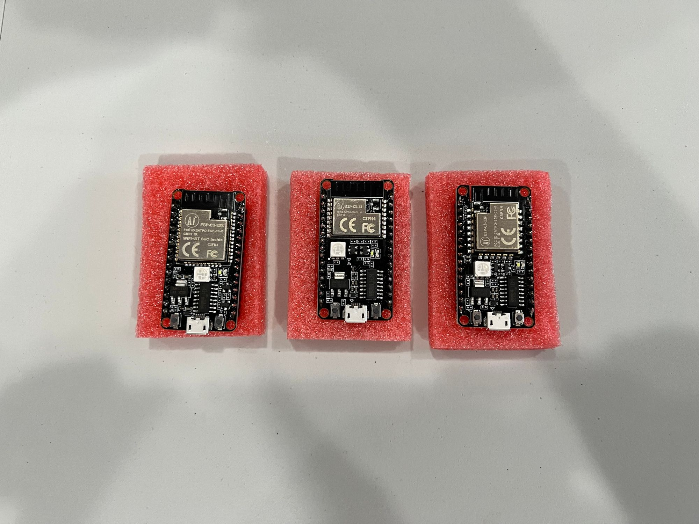
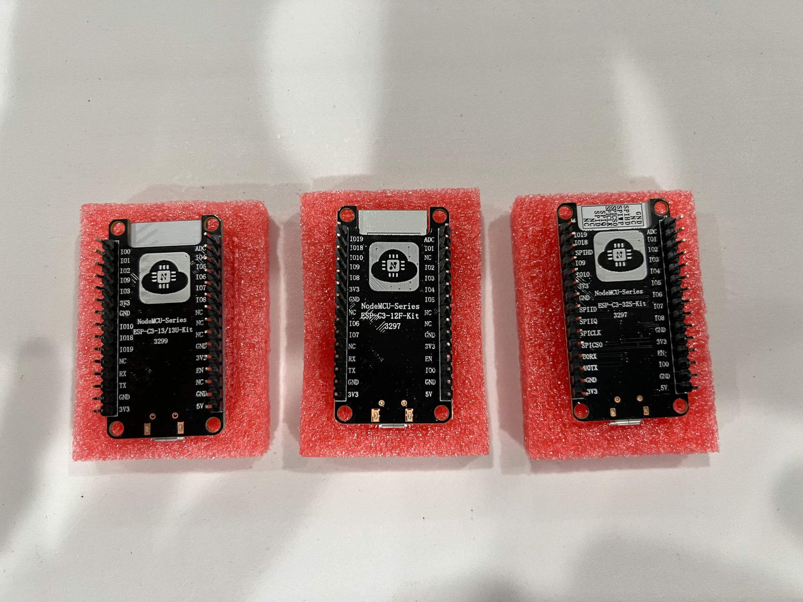

Over the past year, I have been using the esp32 as my go-to Arduino at heart micro-controller. It has Bluetooth and Wi-Fi, it’s power-efficient, and it costs less than $5. In my quest to find something more robust, I found the esp32-c3. <!-- truncate --> The esp32-c3 is one of the new chips in the ever-growing [esp32 family](https://www.espressif.com/en/products/modules). While it was not more powerful, it did introduce some new ideas from espressif that I am excited to see more of as they continue to expand the esp32 family further.

I bought the [3 versions from AliExpress](https://www.aliexpress.com/item/4000220883663.html?spm=a2g0o.9042311.0.0.541f4c4dfnOAfr). One of the hardest things to understand was what all the versions meant. An excerpt from the listing says

> "ESP-C3-32S module acquiesce in using the built-in 4MByte Flash, meanwhile support
> external Flash version"

Trying to find more about the different variants from Ai-Thinker using some of their published pdfs ([https://docs.ai-thinker.com/\_media/esp32/docs/esp-c3-12f_specification.pdf](https://docs.ai-thinker.com/_media/esp32/docs/esp-c3-12f_specification.pdf)) render dead-ends as most of their pdfs are unreachable.

> I have gotten a download of the pdf and if you are looking to see the spec sheet please download below.

[esp-c3-32s-kit-v1.0_specification.pdf](../files/2022/01/esp-c3-32s-kit-v1.0_specification.pdf)

From what I have read online this is mostly around the types of pin-outs. So to investigate further I flipped them around and found that this was the case. One of the most noticeable things missing is the ability to have a serial pinout (SPI) on the other devkits.

> The following table is from <https://docs.espressif.com/projects/esp-idf/en/latest/esp32c3/hw-reference/chip-series-comparison.html>

| Feature                                        | ESP32 Series                                                                                     | ESP32-S2 Series                                                                                              | ESP32-C3 Series                                                                               | ESP32-S3 Series                                                                                                                            |
| ---------------------------------------------- | ------------------------------------------------------------------------------------------------ | ------------------------------------------------------------------------------------------------------------ | --------------------------------------------------------------------------------------------- | ------------------------------------------------------------------------------------------------------------------------------------------ |
| Launch year                                    | 2016                                                                                             | 2020                                                                                                         | 2020                                                                                          | 2020                                                                                                                                       |
| Variants                                       | See ESP32 Datasheet (PDF)                                                                        | See ESP32-S2 Datasheet (PDF)                                                                                 | See ESP32-C3 Datasheet (PDF)                                                                  | See ESP32-S3 Datasheet (PDF)                                                                                                               |
| Core                                           | Xtensa® dual-/single core 32-bit LX6                                                             | Xtensa® single-core 32-bit LX7                                                                               | 32-bit single-core RISC-V                                                                     | Xtensa® dual-core 32-bit LX7                                                                                                               |
| Wi-Fi protocols                                | 802.11 b/g/n, 2.4 GHz                                                                            | 802.11 b/g/n, 2.4 GHz                                                                                        | 802.11 b/g/n, 2.4 GHz                                                                         | 802.11 b/g/n, 2.4 GHz                                                                                                                      |
| Bluetooth®                                     | Bluetooth v4.2 BR/EDR and Bluetooth Low Energy                                                   | ✖️                                                                                                           | Bluetooth 5.0                                                                                 | Bluetooth 5.0                                                                                                                              |
| Typical frequency                              | 240 MHz (160 MHz for ESP32-S0WD)                                                                 | 240 MHz                                                                                                      | 160 MHz                                                                                       | 240 MHz                                                                                                                                    |
| SRAM                                           | 520 KB                                                                                           | 320 KB                                                                                                       | 400 KB                                                                                        | 512 KB                                                                                                                                     |
| ROM                                            | 448 KB for booting and core functions                                                            | 128 KB for booting and core functions                                                                        | 384 KB for booting and core functions                                                         | 384 KB for booting and core functions                                                                                                      |
| Embedded flash                                 | 2 MB, 4 MB, or none, depending on variants                                                       | 2 MB, 4 MB, or none, depending on variants                                                                   | 4 MB or none, depending on variants                                                           | 8 MB or none, depending on variants                                                                                                        |
| External flash                                 | Up to 16 MB device, address 11 MB + 248 KB each time                                             | Up to 1 GB device, address 11.5 MB each time                                                                 | Up to 16 MB device, address 8 MB each time                                                    | Up to 1 GB device, address 32 MB each time                                                                                                 |
| External RAM                                   | Up to 8 MB device, address 4 MB each time                                                        | Up to 1 GB device, address 11.5 MB each time                                                                 | ✖️                                                                                            | Up to 1 GB device, address 32 MB each time                                                                                                 |
| Cache                                          | ✔️ Two-way set associative                                                                       | ✔️ Four-way set associative, independent instruction cache and data cache                                    | ✔️ Eight-way set associative, 32-bit data/instruction bus width                               | ✔️ Four-way or eight-way set associative for instruction cache; four-way set associative for data cache, 32-bit data/instruction bus width |
| Peripherals                                    |                                                                                                  |                                                                                                              |                                                                                               |                                                                                                                                            |
| ADC                                            | Two 12-bit, 18 channels                                                                          | Two 12-bit, 20 channels                                                                                      | Two 12-bit SAR ADCs, at most 6 channels                                                       | Two 12-bit SAR ADCs, 20 channels                                                                                                           |
| DAC                                            | Two 8-bit channels                                                                               | Two 8-bit channels                                                                                           | ✖️                                                                                            | ✖️                                                                                                                                         |
| Timers                                         | Four 64-bit general-purpose timers, and three watchdog timers                                    | Four 64-bit general-purpose timers, and three watchdog timers                                                | Two 54-bit general-purpose timers, and three watchdog timers                                  | Four 54-bit general-purpose timers, and three watchdog timers                                                                              |
| Temperature sensor                             | ✖️                                                                                               | 1                                                                                                            | 1                                                                                             | 1                                                                                                                                          |
| Touch sensor                                   | 10                                                                                               | 14                                                                                                           | ✖️                                                                                            | 14                                                                                                                                         |
| Hall sensor                                    | 1                                                                                                | ✖️                                                                                                           | ✖️                                                                                            | ✖️                                                                                                                                         |
| GPIO                                           | 34                                                                                               | 43                                                                                                           | 22                                                                                            | 45                                                                                                                                         |
| SPI                                            | 4                                                                                                | 4                                                                                                            | 3                                                                                             | 4                                                                                                                                          |
| LCD interface                                  | 1                                                                                                | 1                                                                                                            | ✖️                                                                                            | 1                                                                                                                                          |
| UART                                           | 3                                                                                                | 2 1                                                                                                          | 2 1                                                                                           | 3                                                                                                                                          |
| I2C                                            | 2                                                                                                | 2                                                                                                            | 1                                                                                             | 2                                                                                                                                          |
| I2S                                            | 2, can be configured to operate with 8/16/32/40/48-bit resolution as an input or output channel. | 1, can be configured to operate with 8/16/24/32/48/64-bit resolution as an input or output channel.          | 1, can be configured to operate with 8/16/24/32-bit resolution as an input or output channel. | 2, can be configured to operate with 8/16/24/32-bit resolution as an input or output channel.                                              |
| Camera interface                               | 1                                                                                                | 1                                                                                                            | ✖️                                                                                            | 1                                                                                                                                          |
| DMA                                            | Dedicated DMA to UART, SPI, I2S, SDIO slave, SD/MMC host, EMAC, BT, and Wi-Fi                    | Dedicated DMA to UART, SPI, AES, SHA, I2S, and ADC Controller                                                | General-purpose, 3 TX channels, 3 RX channels                                                 | General-purpose, 5 TX channels, 5 RX channels                                                                                              |
| RMT                                            | 8 channels                                                                                       | 4 channels 1, can be configured to TX/RX channels                                                            | 4 channels 2, 2 TX channels, 2 RX channels                                                    | 8 channels 2, 4 TX channels, 4 RX channels                                                                                                 |
| Pulse counter                                  | 8 channels                                                                                       | 4 channels 1                                                                                                 | ✖️                                                                                            | 4 channels 1                                                                                                                               |
| LED PWM                                        | 16 channels                                                                                      | 8 channels 1                                                                                                 | 6 channels 2                                                                                  | 8 channels 1                                                                                                                               |
| MCPWM                                          | 2, six PWM outputs                                                                               | ✖️                                                                                                           | ✖️                                                                                            | 2, six PWM outputs                                                                                                                         |
| USB OTG                                        | ✖️                                                                                               | 1                                                                                                            | ✖️                                                                                            | 1                                                                                                                                          |
| TWAI® controller (compatible with ISO 11898-1) | 1                                                                                                | 1                                                                                                            | 1                                                                                             | 1                                                                                                                                          |
| SD/SDIO/MMC host controller                    | 1                                                                                                | ✖️                                                                                                           | ✖️                                                                                            | 1                                                                                                                                          |
| SDIO slave controller                          | 1                                                                                                | ✖️                                                                                                           | ✖️                                                                                            | ✖️                                                                                                                                         |
| Ethernet MAC                                   | 1                                                                                                | ✖️                                                                                                           | ✖️                                                                                            | ✖️                                                                                                                                         |
| ULP                                            | ULP FSM                                                                                          | PicoRV32 core with 8 KB SRAM, ULP FSM                                                                        | ✖️                                                                                            | PicoRV32 core with 8 KB SRAM, ULP FSM                                                                                                      |
| Debug Assist                                   | ✖️                                                                                               | ✖️                                                                                                           | 1                                                                                             | ✖️                                                                                                                                         |
| Security                                       |                                                                                                  |                                                                                                              |                                                                                               |                                                                                                                                            |
| Secure boot                                    | ✔️                                                                                               | ✔️ Faster and safer, compared with ESP32                                                                     | ✔️ Faster and safer, compared with ESP32                                                      | ✔️ Faster and safer, compared with ESP32                                                                                                   |
| Flash encryption                               | ✔️                                                                                               | ✔️ Support for PSRAM encryption. Safer, compared with ESP32                                                  | ✔️ Safer, compared with ESP32                                                                 | ✔️ Support for PSRAM encryption. Safer, compared with ESP32                                                                                |
| OTP                                            | 1024-bit                                                                                         | 4096-bit                                                                                                     | 4096-bit                                                                                      | 4096-bit                                                                                                                                   |
| AES                                            | ✔️ AES-128, AES-192, AES-256 (FIPS PUB 197)                                                      | ✔️ AES-128, AES-192, AES-256 (FIPS PUB 197); DMA support                                                     | ✔️ AES-128, AES-256 (FIPS PUB 197); DMA support                                               | ✔️ AES-128, AES-256 (FIPS PUB 197); DMA support                                                                                            |
| HASH                                           | SHA-1, SHA-256, SHA-384, SHA-512 (FIPS PUB 180-4)                                                | SHA-1, SHA-224, SHA-256, SHA-384, SHA-512, SHA-512/224, SHA-512/256, SHA-512/t (FIPS PUB 180-4); DMA support | SHA-1, SHA-224, SHA-256 (FIPS PUB 180-4); DMA support                                         | SHA-1, SHA-224, SHA-256, SHA-384, SHA-512, SHA-512/224, SHA-512/256, SHA-512/t (FIPS PUB 180-4); DMA support                               |
| RSA                                            | Up to 4096 bits                                                                                  | Up to 4096 bits                                                                                              | Up to 3072 bits                                                                               | Up to 4096 bits                                                                                                                            |
| RNG                                            | ✔️                                                                                               | ✔️                                                                                                           | ✔️                                                                                            | ✔️                                                                                                                                         |
| HMAC                                           | ✖️                                                                                               | ✔️                                                                                                           | ✔️                                                                                            | ✔️                                                                                                                                         |
| Digital signature                              | ✖️                                                                                               | ✔️                                                                                                           | ✔️                                                                                            | ✔️                                                                                                                                         |
| XTS                                            | ✖️                                                                                               | ✔️ XTS-AES-128, XTS-AES-256                                                                                  | ✔️ XTS-AES-128                                                                                | ✔️ XTS-AES-128, XTS-AES-256                                                                                                                |
| Other                                          |                                                                                                  |                                                                                                              |                                                                                               |                                                                                                                                            |
| Deep-sleep (ULP sensor-monitored pattern)      | 100 μA (when ADC work with a duty cycle of 1%)                                                   | 22 μA (when touch sensors work with a duty cycle of 1%)                                                      | No such pattern                                                                               | TBD                                                                                                                                        |
| Size                                           | QFN48 5*5, 6*6, depending on variants                                                            | QFN56 7\*7                                                                                                   | QFN32 5\*5                                                                                    | QFN56 7\*7                                                                                                                                 |

While for the most part, this looks like a less feature-filled esp32 compared with the other variants, Hackaday has an article talking about the introduction of the chip when it was first released and said,

> [“Our takeaway: the ESP32-C3 is going to replace the ESP8266 in our projects, but it won’t replace the ESP32 which simply has more of everything when we need it.”](https://hackaday.com/2021/02/08/hands-on-the-risc-v-esp32-c3-will-be-your-new-esp8266/)

I have shared the same sentiment around this chip as I have really enjoyed working with the esp32 in general, this lacks some of the “oomph” of being able to work with more than just one core and some extra internal ROM memory. Based on my own observations, and this was called out in the article, it seems this is a way to get manufacturers with lower margins to stop using esp8266 and instead start using the esp32 family. My understanding is that the encryption is more aligned with the esp8266 and as such hardware manufacturers could not use the esp32 in their products.

## Takeaway

While the power usage is marginally better than the esp32 but contains Bluetooth 5 I am going to keep using this as a way to test out some ideas I have with [https://github.com/project-chip/connectedhomeip#readme](https://github.com/project-chip/connectedhomeip#readme). For other projects, I am going to stick with the esp32 dual-core. My hope is that the [esp32-c6 is going to really push the envelope](https://www.espressif.com/en/news/ESP32_C6) and make me replace my current usages as it introduces Wi-Fi 6 and hopefully Bluetooth 5.2 (The official release document does not specify which variant of Bluetooth 5) If you are going to buy the esp32-c3 look for the 32s variant as that is the one that seems most versatile.
