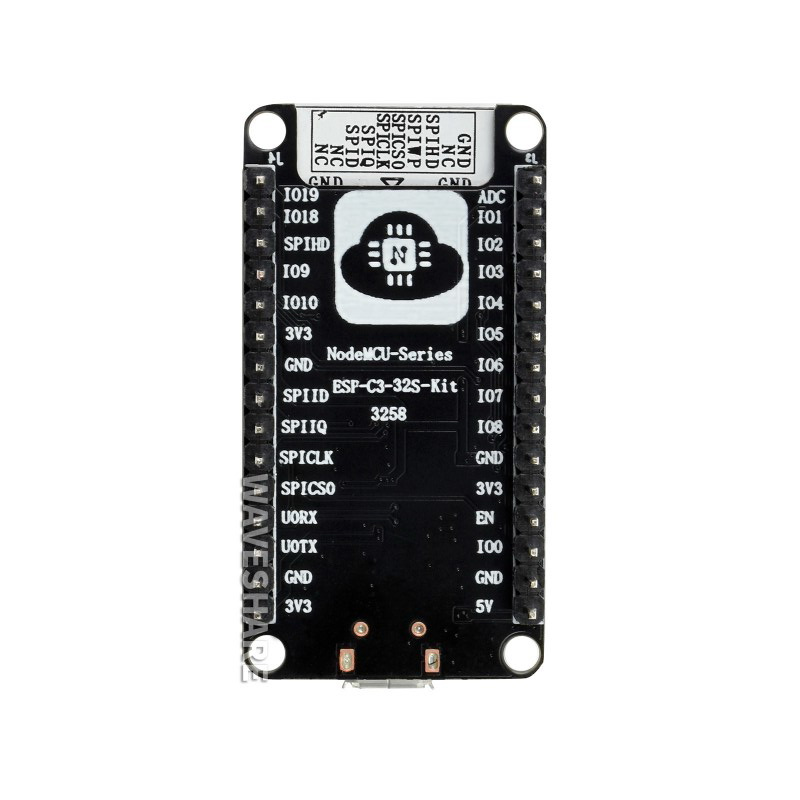
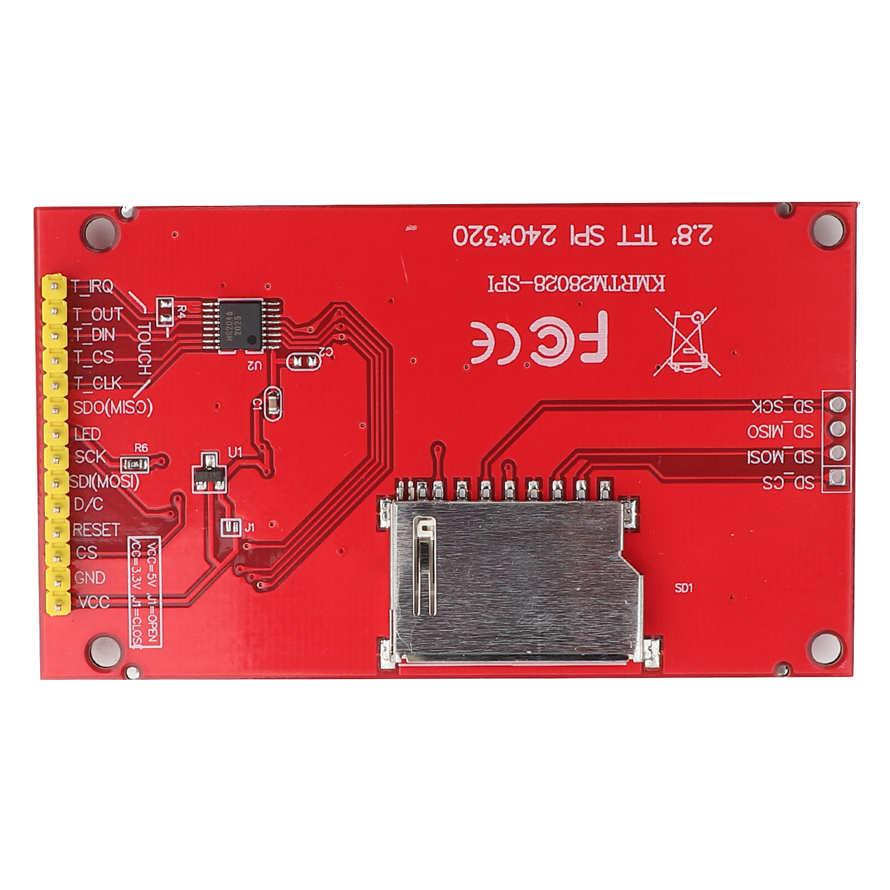
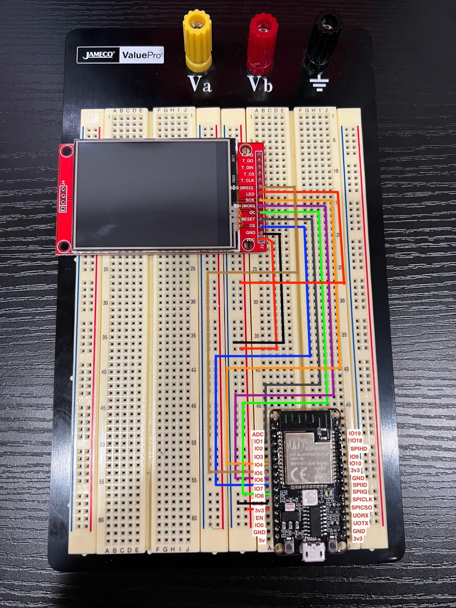

This tutorial goes over how to use an ILI9341 TFT screen with the esp32-c3-32s!

## Supplies

- (1) esp32-c3-32s
- (1) ILI9341 TFT Screen
- (1) Breadboard
- (8) Jumper cables

<!-- truncate -->

## Setup

As this board is extremely small compared to the esp32 that preceded it, the pinout information is on the back of the chip.





v
As this is not a widely used board, I couldn't find a fritzing for it, so I am going to try and make this easy by putting both the board together for you to be able to connect via jumper cables however you please.

| esp32-c3-32s Pin | TFT Pin    |
| ---------------- | ---------- |
| 3v3              | VCC        |
| GND              | GND        |
| IO7              | CS         |
| IO1              | RESET      |
| IO2              | DC         |
| IO6              | SDI (MOSI) |
| IO4              | SCK        |
| LED              | 3v3        |



## Code

For this project, we are using the following libraries:

1. Adafruit_GFX
2. Adafruit_ILI9341

> _For information on how to install the libraries above please visist _[_https://www.arduino.cc/en/guide/libraries_](https://www.arduino.cc/en/guide/libraries)_._

_The following graphics test code was pulled from <https://github.com/adafruit/Adafruit_ILI9341/blob/master/examples/graphicstest/graphicstest.ino>_

### Flash settings

- USB CDC on boot: disabled
- Board: ESP32c3 Dev Module
- CPU Frequency: 80MHZ
- Flash Frequency: 80MHZ
- Flash Mode: DIO
- Flash Size: 4MB
- Partition Scheme: Default 4MB with spiffs
- Upload Speed: 115200

```cpp showLineNumbers
/***************************************************
  This is our GFX example for the Adafruit ILI9341 Breakout and Shield
  ----> http://www.adafruit.com/products/1651
  Check out the links above for our tutorials and wiring diagrams
  These displays use SPI to communicate, 4 or 5 pins are required to
  interface (RST is optional)
  Adafruit invests time and resources providing this open source code,
  please support Adafruit and open-source hardware by purchasing
  products from Adafruit!
  Written by Limor Fried/Ladyada for Adafruit Industries.
  MIT license, all text above must be included in any redistribution
 ****************************************************/

#include "SPI.h"
#include "Adafruit_GFX.h"
#include "Adafruit_ILI9341.h"

#define TFT_CS   7
#define TFT_DC   2
#define TFT_RST  1

Adafruit_ILI9341 tft = Adafruit_ILI9341(TFT_CS, TFT_DC, TFT_RST);

void setup() {
  Serial.begin(9600);
  Serial.println("ILI9341 Test!");

  tft.begin(4000000);

  // read diagnostics (optional but can help debug problems)
  uint8_t x = tft.readcommand8(ILI9341_RDMODE);
  Serial.print("Display Power Mode: 0x"); Serial.println(x, HEX);
  x = tft.readcommand8(ILI9341_RDMADCTL);
  Serial.print("MADCTL Mode: 0x"); Serial.println(x, HEX);
  x = tft.readcommand8(ILI9341_RDPIXFMT);
  Serial.print("Pixel Format: 0x"); Serial.println(x, HEX);
  x = tft.readcommand8(ILI9341_RDIMGFMT);
  Serial.print("Image Format: 0x"); Serial.println(x, HEX);
  x = tft.readcommand8(ILI9341_RDSELFDIAG);
  Serial.print("Self Diagnostic: 0x"); Serial.println(x, HEX);

  Serial.println(F("Benchmark                Time (microseconds)"));
  delay(10);
  Serial.print(F("Screen fill              "));
  Serial.println(testFillScreen());
  delay(500);

  Serial.print(F("Text                     "));
  Serial.println(testText());
  delay(3000);

  Serial.print(F("Lines                    "));
  Serial.println(testLines(ILI9341_CYAN));
  delay(500);

  Serial.print(F("Horiz/Vert Lines         "));
  Serial.println(testFastLines(ILI9341_RED, ILI9341_BLUE));
  delay(500);

  Serial.print(F("Rectangles (outline)     "));
  Serial.println(testRects(ILI9341_GREEN));
  delay(500);

  Serial.print(F("Rectangles (filled)      "));
  Serial.println(testFilledRects(ILI9341_YELLOW, ILI9341_MAGENTA));
  delay(500);

  Serial.print(F("Circles (filled)         "));
  Serial.println(testFilledCircles(10, ILI9341_MAGENTA));

  Serial.print(F("Circles (outline)        "));
  Serial.println(testCircles(10, ILI9341_WHITE));
  delay(500);

  Serial.print(F("Triangles (outline)      "));
  Serial.println(testTriangles());
  delay(500);

  Serial.print(F("Triangles (filled)       "));
  Serial.println(testFilledTriangles());
  delay(500);

  Serial.print(F("Rounded rects (outline)  "));
  Serial.println(testRoundRects());
  delay(500);

  Serial.print(F("Rounded rects (filled)   "));
  Serial.println(testFilledRoundRects());
  delay(500);

  Serial.println(F("Done!"));

}


void loop(void) {
  for(uint8_t rotation=0; rotation<4; rotation++) {
    tft.setRotation(rotation);
    testText();
    delay(1000);
  }
}

unsigned long testFillScreen() {
  unsigned long start = micros();
  tft.fillScreen(ILI9341_BLACK);
  yield();
  tft.fillScreen(ILI9341_RED);
  yield();
  tft.fillScreen(ILI9341_GREEN);
  yield();
  tft.fillScreen(ILI9341_BLUE);
  yield();
  tft.fillScreen(ILI9341_BLACK);
  yield();
  return micros() - start;
}

unsigned long testText() {
  tft.fillScreen(ILI9341_BLACK);
  unsigned long start = micros();
  tft.setCursor(0, 0);
  tft.setTextColor(ILI9341_WHITE);  tft.setTextSize(1);
  tft.println("Hello World!");
  tft.setTextColor(ILI9341_YELLOW); tft.setTextSize(2);
  tft.println(1234.56);
  tft.setTextColor(ILI9341_RED);    tft.setTextSize(3);
  tft.println(0xDEADBEEF, HEX);
  tft.println();
  tft.setTextColor(ILI9341_GREEN);
  tft.setTextSize(5);
  tft.println("Groop");
  tft.setTextSize(2);
  tft.println("I implore thee,");
  tft.setTextSize(1);
  tft.println("my foonting turlingdromes.");
  tft.println("And hooptiously drangle me");
  tft.println("with crinkly bindlewurdles,");
  tft.println("Or I will rend thee");
  tft.println("in the gobberwarts");
  tft.println("with my blurglecruncheon,");
  tft.println("see if I don't!");
  return micros() - start;
}

unsigned long testLines(uint16_t color) {
  unsigned long start, t;
  int           x1, y1, x2, y2,
                w = tft.width(),
                h = tft.height();

  tft.fillScreen(ILI9341_BLACK);
  yield();

  x1 = y1 = 0;
  y2    = h - 1;
  start = micros();
  for(x2=0; x2<w; x2+=6) tft.drawLine(x1, y1, x2, y2, color);
  x2    = w - 1;
  for(y2=0; y2<h; y2+=6) tft.drawLine(x1, y1, x2, y2, color);
  t     = micros() - start; // fillScreen doesn't count against timing

  yield();
  tft.fillScreen(ILI9341_BLACK);
  yield();

  x1    = w - 1;
  y1    = 0;
  y2    = h - 1;
  start = micros();
  for(x2=0; x2<w; x2+=6) tft.drawLine(x1, y1, x2, y2, color);
  x2    = 0;
  for(y2=0; y2<h; y2+=6) tft.drawLine(x1, y1, x2, y2, color);
  t    += micros() - start;

  yield();
  tft.fillScreen(ILI9341_BLACK);
  yield();

  x1    = 0;
  y1    = h - 1;
  y2    = 0;
  start = micros();
  for(x2=0; x2<w; x2+=6) tft.drawLine(x1, y1, x2, y2, color);
  x2    = w - 1;
  for(y2=0; y2<h; y2+=6) tft.drawLine(x1, y1, x2, y2, color);
  t    += micros() - start;

  yield();
  tft.fillScreen(ILI9341_BLACK);
  yield();

  x1    = w - 1;
  y1    = h - 1;
  y2    = 0;
  start = micros();
  for(x2=0; x2<w; x2+=6) tft.drawLine(x1, y1, x2, y2, color);
  x2    = 0;
  for(y2=0; y2<h; y2+=6) tft.drawLine(x1, y1, x2, y2, color);

  yield();
  return micros() - start;
}

unsigned long testFastLines(uint16_t color1, uint16_t color2) {
  unsigned long start;
  int           x, y, w = tft.width(), h = tft.height();

  tft.fillScreen(ILI9341_BLACK);
  start = micros();
  for(y=0; y<h; y+=5) tft.drawFastHLine(0, y, w, color1);
  for(x=0; x<w; x+=5) tft.drawFastVLine(x, 0, h, color2);

  return micros() - start;
}

unsigned long testRects(uint16_t color) {
  unsigned long start;
  int           n, i, i2,
                cx = tft.width()  / 2,
                cy = tft.height() / 2;

  tft.fillScreen(ILI9341_BLACK);
  n     = min(tft.width(), tft.height());
  start = micros();
  for(i=2; i<n; i+=6) {
    i2 = i / 2;
    tft.drawRect(cx-i2, cy-i2, i, i, color);
  }

  return micros() - start;
}

unsigned long testFilledRects(uint16_t color1, uint16_t color2) {
  unsigned long start, t = 0;
  int           n, i, i2,
                cx = tft.width()  / 2 - 1,
                cy = tft.height() / 2 - 1;

  tft.fillScreen(ILI9341_BLACK);
  n = min(tft.width(), tft.height());
  for(i=n; i>0; i-=6) {
    i2    = i / 2;
    start = micros();
    tft.fillRect(cx-i2, cy-i2, i, i, color1);
    t    += micros() - start;
    // Outlines are not included in timing results
    tft.drawRect(cx-i2, cy-i2, i, i, color2);
    yield();
  }

  return t;
}

unsigned long testFilledCircles(uint8_t radius, uint16_t color) {
  unsigned long start;
  int x, y, w = tft.width(), h = tft.height(), r2 = radius * 2;

  tft.fillScreen(ILI9341_BLACK);
  start = micros();
  for(x=radius; x<w; x+=r2) {
    for(y=radius; y<h; y+=r2) {
      tft.fillCircle(x, y, radius, color);
    }
  }

  return micros() - start;
}

unsigned long testCircles(uint8_t radius, uint16_t color) {
  unsigned long start;
  int           x, y, r2 = radius * 2,
                w = tft.width()  + radius,
                h = tft.height() + radius;

  // Screen is not cleared for this one -- this is
  // intentional and does not affect the reported time.
  start = micros();
  for(x=0; x<w; x+=r2) {
    for(y=0; y<h; y+=r2) {
      tft.drawCircle(x, y, radius, color);
    }
  }

  return micros() - start;
}

unsigned long testTriangles() {
  unsigned long start;
  int           n, i, cx = tft.width()  / 2 - 1,
                      cy = tft.height() / 2 - 1;

  tft.fillScreen(ILI9341_BLACK);
  n     = min(cx, cy);
  start = micros();
  for(i=0; i<n; i+=5) {
    tft.drawTriangle(
      cx    , cy - i, // peak
      cx - i, cy + i, // bottom left
      cx + i, cy + i, // bottom right
      tft.color565(i, i, i));
  }

  return micros() - start;
}

unsigned long testFilledTriangles() {
  unsigned long start, t = 0;
  int           i, cx = tft.width()  / 2 - 1,
                   cy = tft.height() / 2 - 1;

  tft.fillScreen(ILI9341_BLACK);
  start = micros();
  for(i=min(cx,cy); i>10; i-=5) {
    start = micros();
    tft.fillTriangle(cx, cy - i, cx - i, cy + i, cx + i, cy + i,
      tft.color565(0, i*10, i*10));
    t += micros() - start;
    tft.drawTriangle(cx, cy - i, cx - i, cy + i, cx + i, cy + i,
      tft.color565(i*10, i*10, 0));
    yield();
  }

  return t;
}

unsigned long testRoundRects() {
  unsigned long start;
  int           w, i, i2,
                cx = tft.width()  / 2 - 1,
                cy = tft.height() / 2 - 1;

  tft.fillScreen(ILI9341_BLACK);
  w     = min(tft.width(), tft.height());
  start = micros();
  for(i=0; i<w; i+=6) {
    i2 = i / 2;
    tft.drawRoundRect(cx-i2, cy-i2, i, i, i/8, tft.color565(i, 0, 0));
  }

  return micros() - start;
}

unsigned long testFilledRoundRects() {
  unsigned long start;
  int           i, i2,
                cx = tft.width()  / 2 - 1,
                cy = tft.height() / 2 - 1;

  tft.fillScreen(ILI9341_BLACK);
  start = micros();
  for(i=min(tft.width(), tft.height()); i>20; i-=6) {
    i2 = i / 2;
    tft.fillRoundRect(cx-i2, cy-i2, i, i, i/8, tft.color565(0, i, 0));
    yield();
  }

  return micros() - start;
}
```

Upon running this you should be able to get the following output


For those who are running this with a hardware SPI or something that looks like

```cpp
#define TFT_CS   7
#define TFT_DC   2
#define TFT_MOSI 6
#define TFT_CLK  4
#define TFT_RST  1
#define TFT_MISO 5

Adafruit_ILI9341 tft = Adafruit_ILI9341(TFT_CS, TFT_DC, TFT_MOSI, TFT_CLK, TFT_RST, TFT_MISO);
```

Using hardware SPI, incredibly slow. For more details visit [https://github.com/adafruit/Adafruit_ILI9341/issues/65](https://github.com/adafruit/Adafruit_ILI9341/issues/65)
This will yield incredibly slow results. This is called out in an open issue [https://github.com/adafruit/Adafruit_ILI9341/issues/65](https://github.com/adafruit/Adafruit_ILI9341/issues/65) and was originally the most frustrating part about trying to get the esp32-c3-32s working with an ILI9341 TFT screen. After I made the changes to use a software SPI it was incredibly fast.

```cpp
#define TFT_CS   7
#define TFT_DC   2
#define TFT_RST  1

Adafruit_ILI9341 tft = Adafruit_ILI9341(TFT_CS, TFT_DC, TFT_RST);
```

This is using a software SPI which is way faster than hardware SPI.
