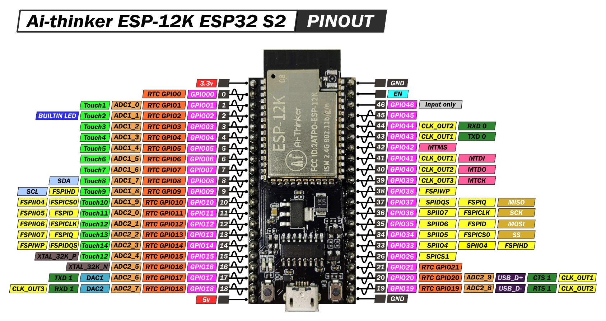

This tutorial explains how to use an ILI9341 with a touchscreen driven by an esp32-s2!

<!-- truncate -->

## Supplies

- (1) esp32-s2-12k
- (13) Jumper wires
- (1) ILI9341 with Touchscreen

> _For refrence I have included the pinout diagram for the esp32-c3-32s that I am using._



> I have included the specsheet for this chip in case it is removed, the original source location is [https://docs.ai-thinker.com/en/12k_development_board_esp32-s2](https://docs.ai-thinker.com/en/12k_development_board_esp32-s2)

[Esp-2s-12k_specsheet_en.pdf](../files/2022/01/Esp-2s-12k_specsheet_en-1.pdf)

## Checkup

It's always good to double-check we are using the right screen as many screens look touch-capable but are not. Check out the steps to make sure they are by reading [https://www.gabrielcsapo.com/hardware-how-to-identify-an-ili9341-that-supports-touch/](../2022-01-29-hardware-how-to-identify-an-ili9341-that-supports-touch/2022-01-29-hardware-how-to-identify-an-ili9341-that-supports-touch.md).

## Setup

Alright, now that we have figured out if the touchscreen you have is touch-capable, time to set up the esp32-s2-12k and the ILI9341 display.

| esp32-s2-12k Pins | TFT Pins   |
| ----------------- | ---------- |
| 3V3               | VCC        |
| GND               | GND        |
| 10                | CS         |
| 15                | RESET      |
| 11                | SDI (MOSI) |
| 12                | SCK        |
| 3V3               | LED        |
| 12                | T_CLK      |
| 34                | T_CS       |
| 11                | T_DIN      |
| 13                | T_DO       |

[](./images/arduino-esp32-s2-ili9341-with-touchscreen_bb-1.png)

## Coding

There are, like most things, multiple ways you can program this board to support touch and display out.

### Flash settings

- USB CDC on boot: disabled
- Board: ESP32S2 Dev Modules
- CPU Frequency: 240MHZ
- Flash Frequency: 40MHZ
- Flash Mode: DIO
- Flash Size: 4MB
- Partition Scheme: Default 4MB with spiffs
- Upload Mode: UARTO
- Upload Speed: 460800

### [TFT_eSPI](https://github.com/Bodmer/TFT_eSPI)

We are using the following libraries:

1. [TFT_eSPI](https://github.com/Bodmer/TFT_eSPI)

> _For information on how to install the libraries above please visist_[_https://www.arduino.cc/en/guide/libraries_](https://www.arduino.cc/en/guide/libraries)_._

Working with TFT_eSPI, you need to edit `User_Setup.h` it is located in your Arduino folder libraries folder. To find this location check out [https://support.arduino.cc/hc/en-us/articles/4411202655634-Find-Arduino-IDE-files-and-folders](https://support.arduino.cc/hc/en-us/articles/4411202655634-Find-Arduino-IDE-files-and-folders) which has more info on the exact location for your machine.

```cpp title="User_Setup.h"
#define ILI9341_DRIVER

#define TFT_CS   10
#define TFT_MOSI 11
#define TFT_SCLK 12
#define TFT_MISO 13
#define TFT_DC   14
#define TFT_RST  15
#define TOUCH_CS 34

#define LOAD_GLCD
#define LOAD_FONT2
#define LOAD_FONT4
#define LOAD_FONT6
#define LOAD_FONT7
#define LOAD_FONT8
#define LOAD_GFXFF
#define SMOOTH_FONT

#define USE_HSPI_PORT
#define SPI_FREQUENCY  40000000
#define SPI_TOUCH_FREQUENCY 2500000
```

Once we have the `User_Setup.h` configured we can use one of the existing sketches. One of the most intricate examples is the keypad example (<https://github.com/Bodmer/TFT_eSPI/blob/master/examples/320%20x%20240/Keypad_240x320/Keypad_240x320.ino>). It shows off having a single library handle both touch and rendering provides a lot of out of the box wins.

```cpp showLineNumbers
/*
The TFT_eSPI library incorporates an Adafruit_GFX compatible
button handling class, this sketch is based on the Arduin-o-phone
example.
This example diplays a keypad where numbers can be entered and
send to the Serial Monitor window.
The sketch has been tested on the ESP8266 (which supports SPIFFS)
The minimum screen size is 320 x 240 as that is the keypad size.
*/

// The SPIFFS (FLASH filing system) is used to hold touch screen
// calibration data

#include "FS.h"

#include <SPI.h>
#include <TFT_eSPI.h>      // Hardware-specific library

TFT_eSPI tft = TFT_eSPI(); // Invoke custom library

// This is the file name used to store the calibration data
// You can change this to create new calibration files.
// The SPIFFS file name must start with "/".
#define CALIBRATION_FILE "/TouchCalData1"

// Set REPEAT_CAL to true instead of false to run calibration
// again, otherwise it will only be done once.
// Repeat calibration if you change the screen rotation.
#define REPEAT_CAL false

// Keypad start position, key sizes and spacing
#define KEY_X 40 // Centre of key
#define KEY_Y 96
#define KEY_W 62 // Width and height
#define KEY_H 30
#define KEY_SPACING_X 18 // X and Y gap
#define KEY_SPACING_Y 20
#define KEY_TEXTSIZE 1   // Font size multiplier

// Using two fonts since numbers are nice when bold
#define LABEL1_FONT &FreeSansOblique12pt7b // Key label font 1
#define LABEL2_FONT &FreeSansBold12pt7b    // Key label font 2

// Numeric display box size and location
#define DISP_X 1
#define DISP_Y 10
#define DISP_W 238
#define DISP_H 50
#define DISP_TSIZE 3
#define DISP_TCOLOR TFT_CYAN

// Number length, buffer for storing it and character index
#define NUM_LEN 12
char numberBuffer[NUM_LEN + 1] = "";
uint8_t numberIndex = 0;

// We have a status line for messages
#define STATUS_X 120 // Centred on this
#define STATUS_Y 65

// Create 15 keys for the keypad
char keyLabel[15][5] = {"New", "Del", "Send", "1", "2", "3", "4", "5", "6", "7", "8", "9", ".", "0", "#" };
uint16_t keyColor[15] = {TFT_RED, TFT_DARKGREY, TFT_DARKGREEN,
                       TFT_BLUE, TFT_BLUE, TFT_BLUE,
                       TFT_BLUE, TFT_BLUE, TFT_BLUE,
                       TFT_BLUE, TFT_BLUE, TFT_BLUE,
                       TFT_BLUE, TFT_BLUE, TFT_BLUE
                      };

// Invoke the TFT_eSPI button class and create all the button objects
TFT_eSPI_Button key[15];

//------------------------------------------------------------------------------------------

void setup() {
// Use serial port
Serial.begin(9600);

// Initialise the TFT screen
tft.init();

// Set the rotation before we calibrate
tft.setRotation(0);

// Calibrate the touch screen and retrieve the scaling factors
touch_calibrate();

// Clear the screen
tft.fillScreen(TFT_BLACK);

// Draw keypad background
tft.fillRect(0, 0, 240, 320, TFT_DARKGREY);

// Draw number display area and frame
tft.fillRect(DISP_X, DISP_Y, DISP_W, DISP_H, TFT_BLACK);
tft.drawRect(DISP_X, DISP_Y, DISP_W, DISP_H, TFT_WHITE);

// Draw keypad
drawKeypad();
}

//------------------------------------------------------------------------------------------

void loop(void) {
uint16_t t_x = 0, t_y = 0; // To store the touch coordinates

// Pressed will be set true is there is a valid touch on the screen
bool pressed = tft.getTouch(&t_x, &t_y);

// / Check if any key coordinate boxes contain the touch coordinates
for (uint8_t b = 0; b < 15; b++) {
  if (pressed && key[b].contains(t_x, t_y)) {
    key[b].press(true);  // tell the button it is pressed
  } else {
    key[b].press(false);  // tell the button it is NOT pressed
  }
}

// Check if any key has changed state
for (uint8_t b = 0; b < 15; b++) {

  if (b < 3) tft.setFreeFont(LABEL1_FONT);
  else tft.setFreeFont(LABEL2_FONT);

  if (key[b].justReleased()) key[b].drawButton();     // draw normal

  if (key[b].justPressed()) {
    key[b].drawButton(true);  // draw invert

    // if a numberpad button, append the relevant ## to the numberBuffer
    if (b >= 3) {
      if (numberIndex < NUM_LEN) {
        numberBuffer[numberIndex] = keyLabel[b][0];
        numberIndex++;
        numberBuffer[numberIndex] = 0; // zero terminate
      }
      status(""); // Clear the old status
    }

    // Del button, so delete last char
    if (b == 1) {
      numberBuffer[numberIndex] = 0;
      if (numberIndex > 0) {
        numberIndex--;
        numberBuffer[numberIndex] = 0;//' ';
      }
      status(""); // Clear the old status
    }

    if (b == 2) {
      status("Sent value to serial port");
      Serial.println(numberBuffer);
    }
    // we dont really check that the text field makes sense
    // just try to call
    if (b == 0) {
      status("Value cleared");
      numberIndex = 0; // Reset index to 0
      numberBuffer[numberIndex] = 0; // Place null in buffer
    }

    // Update the number display field
    tft.setTextDatum(TL_DATUM);        // Use top left corner as text coord datum
    tft.setFreeFont(&FreeSans18pt7b);  // Choose a nicefont that fits box
    tft.setTextColor(DISP_TCOLOR);     // Set the font colour

    // Draw the string, the value returned is the width in pixels
    int xwidth = tft.drawString(numberBuffer, DISP_X + 4, DISP_Y + 12);

    // Now cover up the rest of the line up by drawing a black rectangle.  No flicker this way
    // but it will not work with italic or oblique fonts due to character overlap.
    tft.fillRect(DISP_X + 4 + xwidth, DISP_Y + 1, DISP_W - xwidth - 5, DISP_H - 2, TFT_BLACK);

    delay(10); // UI debouncing
  }
}
}

//------------------------------------------------------------------------------------------

void drawKeypad()
{
// Draw the keys
for (uint8_t row = 0; row < 5; row++) {
  for (uint8_t col = 0; col < 3; col++) {
    uint8_t b = col + row * 3;

    if (b < 3) tft.setFreeFont(LABEL1_FONT);
    else tft.setFreeFont(LABEL2_FONT);

    key[b].initButton(&tft, KEY_X + col * (KEY_W + KEY_SPACING_X),
                      KEY_Y + row * (KEY_H + KEY_SPACING_Y), // x, y, w, h, outline, fill, text
                      KEY_W, KEY_H, TFT_WHITE, keyColor[b], TFT_WHITE,
                      keyLabel[b], KEY_TEXTSIZE);
    key[b].drawButton();
  }
}
}

//------------------------------------------------------------------------------------------

void touch_calibrate()
{
uint16_t calData[5];
uint8_t calDataOK = 0;

// check file system exists
if (!SPIFFS.begin()) {
  Serial.println("Formating file system");
  SPIFFS.format();
  SPIFFS.begin();
}

// check if calibration file exists and size is correct
if (SPIFFS.exists(CALIBRATION_FILE)) {
  if (REPEAT_CAL)
  {
    // Delete if we want to re-calibrate
    SPIFFS.remove(CALIBRATION_FILE);
  }
  else
  {
    File f = SPIFFS.open(CALIBRATION_FILE, "r");
    if (f) {
      if (f.readBytes((char *)calData, 14) == 14)
        calDataOK = 1;
      f.close();
    }
  }
}

if (calDataOK && !REPEAT_CAL) {
  // calibration data valid
  tft.setTouch(calData);
} else {
  // data not valid so recalibrate
  tft.fillScreen(TFT_BLACK);
  tft.setCursor(20, 0);
  tft.setTextFont(2);
  tft.setTextSize(1);
  tft.setTextColor(TFT_WHITE, TFT_BLACK);

  tft.println("Touch corners as indicated");

  tft.setTextFont(1);
  tft.println();

  if (REPEAT_CAL) {
    tft.setTextColor(TFT_RED, TFT_BLACK);
    tft.println("Set REPEAT_CAL to false to stop this running again!");
  }

  tft.calibrateTouch(calData, TFT_MAGENTA, TFT_BLACK, 15);

  tft.setTextColor(TFT_GREEN, TFT_BLACK);
  tft.println("Calibration complete!");

  // store data
  File f = SPIFFS.open(CALIBRATION_FILE, "w");
  if (f) {
    f.write((const unsigned char *)calData, 14);
    f.close();
  }
}
}

//------------------------------------------------------------------------------------------

// Print something in the mini status bar
void status(const char *msg) {
tft.setTextPadding(240);
//tft.setCursor(STATUS_X, STATUS_Y);
tft.setTextColor(TFT_WHITE, TFT_DARKGREY);
tft.setTextFont(0);
tft.setTextDatum(TC_DATUM);
tft.setTextSize(1);
tft.drawString(msg, STATUS_X, STATUS_Y);
}

//------------------------------------------------------------------------------------------
```

> Keypad example is taken from <https://github.com/Bodmer/TFT_eSPI/blob/master/examples/320%20x%20240/Keypad_240x320/Keypad_240x320.ino>.

One of the benefits of using TFT_eSPI is having the ability to calibrate your display and having that as a part of your workflow. This does require SPIFFS to store this information, so having something like the esp32 family is a well-suited library for most of your needs.


### [XPT2046_Touchscreen](https://github.com/PaulStoffregen/XPT2046_Touchscreen)

Another library that works with this particular touchscreen is [XPT2046_Touchscreen](https://github.com/PaulStoffregen/XPT2046_Touchscreen).

We are using the following libraries:

1. [XPT2046_Touchscreen](https://github.com/PaulStoffregen/XPT2046_Touchscreen)

> _For information on how to install the libraries above please visit [\_https://www.arduino.cc/en/guide/libraries_](https://www.arduino.cc/en/guide/libraries)_._

We are going to be using a sketch I wrote for [https://www.gabrielcsapo.com/arduino-esp32-c3-32s-ili9341-with-touchscreen/](../2022-01-22-arduino-esp32-c3-32s-ili9341-with-touchscreen/2022-01-22-arduino-esp32-c3-32s-ili9341-with-touchscreen.md). To look at the most up-to-date [sketch you can check it out here](https://github.com/gabrielcsapo/gabrielcsapo.com/blob/main/arduino-esp32-s2-ili9341-with-touchscreen/sketch/sketch.ino).

```cpp showLineNumbers
 #include "Adafruit_GFX.h"
 #include "Adafruit_ILI9341.h"
 #include <XPT2046_Touchscreen.h>
 #include <SPI.h>

 #define SCLK_PIN              12
 #define MISO_PIN              13
 #define MOSI_PIN              11

 #define TOUCH_CS 34

 #define TFT_DC 14
 #define TFT_CS 10
 #define TFT_RST  15

 XPT2046_Touchscreen ts(TOUCH_CS);

 Adafruit_ILI9341 tft = Adafruit_ILI9341(TFT_CS, TFT_DC, TFT_RST);

 void setup() {
   Serial.begin(38400);

   SPI.begin( SCLK_PIN, MISO_PIN, MOSI_PIN );
   SPI.setFrequency( 40000000 );

   tft.begin(4000000);
   tft.setRotation(1);
   tft.fillScreen(ILI9341_BLACK);
   ts.begin();
   ts.setRotation(1);
   while (!Serial && (millis() <= 1000));
 }

 boolean wastouched = true;

 void loop() {
   boolean istouched = ts.touched();
   if (istouched) {
     TS_Point p = ts.getPoint();
     if (!wastouched) {
       tft.fillScreen(ILI9341_BLACK);
       tft.setTextColor(ILI9341_YELLOW);
       tft.setCursor(60, 80);
       tft.print("Touch");
     }
     tft.fillRect(100, 150, 140, 60, ILI9341_BLACK);
     tft.setTextColor(ILI9341_GREEN);
     tft.setCursor(100, 150);
     tft.print("X = ");
     tft.print(p.x);
     tft.setCursor(100, 180);
     tft.print("Y = ");
     tft.print(p.y);
     Serial.print(", x = ");
     Serial.print(p.x);
     Serial.print(", y = ");
     Serial.println(p.y);
   } else {
     if (wastouched) {
       tft.fillScreen(ILI9341_BLACK);
       tft.setTextColor(ILI9341_RED);
       tft.setCursor(120, 50);
       tft.print("No");
       tft.setCursor(80, 120);
       tft.print("Touch");
     }
     Serial.println("no touch");
   }
   wastouched = istouched;
   delay(100);
 }
```

Sketch for [XPT2046_Touchscreen](https://github.com/PaulStoffregen/XPT2046_Touchscreen).


Example running the [XPT2046_Touchscreen](https://github.com/PaulStoffregen/XPT2046_Touchscreen) example above.

### Conclusion

Picking the right library for your needs is important. There are considerations to be made between [XPT2046_Touchscreen](https://github.com/PaulStoffregen/XPT2046_Touchscreen) and [TFT_eSPI](https://github.com/Bodmer/TFT_eSPI) such as compatibility and required space to run on your device. I have yet to use either in any real-life application other than some of the two examples provided, when I do I will put my findings here.
