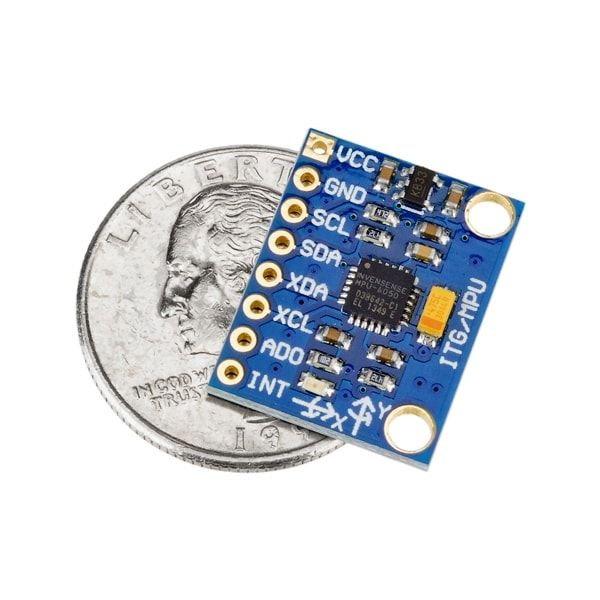
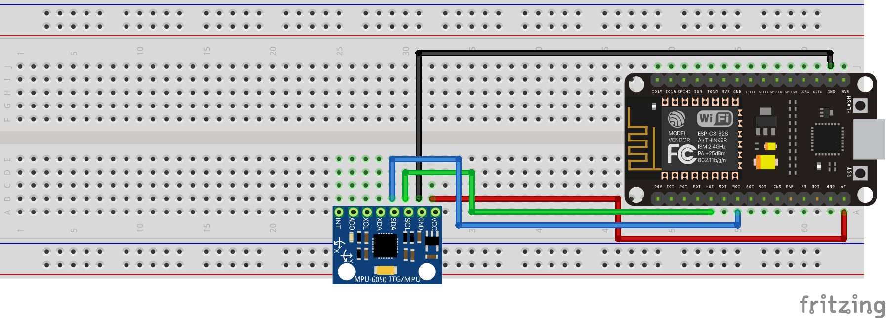

This tutorial explains how to use a GY-521 driven by an esp32-c3! This is an I2C board with a combined Gyroscope and Accelerometer. It has the ability to get:

- X, Y and Z acceleration
- X, Y, Z gyroscope
- Temperature sensor

<!-- truncate -->

This board also has the ability to change the quality of the data being processed internally by the DMP (Internal Digital Motion Processing) unit which handles filtering out data based on the settings. With that, the device can also handle being put to sleep.

> I linked the spec sheet I found originally from <http://www.haoyuelectronics.com/Attachment/GY-521/mpu6050.pdf>. Things get taken down all the time so I have been trying to keep all my spec sheets for the boards I have been working with.

[Mpu6050.pdf](../files/2022/02/mpu6050.pdf)

I was super interested in seeing how this chip worked based on a week Joey Castillo posted:

> HOT DAMN, that&#39;s some good looking data! [#SensorWatch](https://twitter.com/hashtag/SensorWatch?src=hash&ref_src=twsrc%5Etfw)[pic.twitter.com/fH9HT91f8b](https://t.co/fH9HT91f8b) > &mdash; joey castillo (@josecastillo) [February 20, 2022](https://twitter.com/josecastillo/status/1495457090462269444?ref_src=twsrc%5Etfw)

Joey Castillo getting sensor data from his watch
Even cooler he put this data through a program to see if he could train a model to recognize certain activities!

> Not bad for a 30 minute run! The tool split my jogging data into two separate sets, one for training and one for testing; running the testing data against the trained model, it&#39;s 99.8% accurate for jogging. [pic.twitter.com/vcCHJWYTAX](https://t.co/vcCHJWYTAX) > &mdash; joey castillo (@josecastillo) [February 20, 2022](https://twitter.com/josecastillo/status/1495543584140976130?ref_src=twsrc%5Etfw)

Joey Castillo analyzing sensor data

## Supplies

- (1) esp32-c3
- (1) GY-521
- (4)  Jumper wires



## Setup



## Coding

For this project, we are using the following libraries:

1. Adafruit_MPU6050
2. Adafruit_Sensor

> _For information on how to install the libraries above please visist_[_https://www.arduino.cc/en/guide/libraries_](https://www.arduino.cc/en/guide/libraries)_._

### Flash settings

- USB CDC on boot: disabled
- Board: ESP32c3 Dev Module
- CPU Frequency: 80MHZ
- Flash Frequency: 80MHZ
- Flash Mode: DIO
- Flash Size: 4MB
- Partition Scheme: Default 4MB with spiffs
- Upload Speed: 115200

One of the cool things about esp32-c3, more boards can, but it assign any pins to be i2c pins (SCL, SDA). For this example, we are using 4 as SCL and 6 as SDA.

This example just shows a basic

```cpp showLineNumbers
#include <Adafruit_MPU6050.h>
#include <Adafruit_Sensor.h>
#include <Wire.h>

Adafruit_MPU6050 mpu;

void setup(void) {
  Serial.begin(115200);
  while (!Serial)
    delay(10); // will pause Zero, Leonardo, etc until serial console opens

  Wire.begin(6, 4);
  Serial.println("Adafruit MPU6050 test!");

  // Try to initialize!
  if (!mpu.begin()) {
    Serial.println("Failed to find MPU6050 chip");
    while (1) {
      delay(10);
    }
  }
  Serial.println("MPU6050 Found!");

  mpu.setAccelerometerRange(MPU6050_RANGE_8_G);
  Serial.print("Accelerometer range set to: ");
  switch (mpu.getAccelerometerRange()) {
  case MPU6050_RANGE_2_G:
    Serial.println("+-2G");
    break;
  case MPU6050_RANGE_4_G:
    Serial.println("+-4G");
    break;
  case MPU6050_RANGE_8_G:
    Serial.println("+-8G");
    break;
  case MPU6050_RANGE_16_G:
    Serial.println("+-16G");
    break;
  }
  mpu.setGyroRange(MPU6050_RANGE_500_DEG);
  Serial.print("Gyro range set to: ");
  switch (mpu.getGyroRange()) {
  case MPU6050_RANGE_250_DEG:
    Serial.println("+- 250 deg/s");
    break;
  case MPU6050_RANGE_500_DEG:
    Serial.println("+- 500 deg/s");
    break;
  case MPU6050_RANGE_1000_DEG:
    Serial.println("+- 1000 deg/s");
    break;
  case MPU6050_RANGE_2000_DEG:
    Serial.println("+- 2000 deg/s");
    break;
  }

  mpu.setFilterBandwidth(MPU6050_BAND_10_HZ);
  Serial.print("Filter bandwidth set to: ");
  switch (mpu.getFilterBandwidth()) {
  case MPU6050_BAND_260_HZ:
    Serial.println("260 Hz");
    break;
  case MPU6050_BAND_184_HZ:
    Serial.println("184 Hz");
    break;
  case MPU6050_BAND_94_HZ:
    Serial.println("94 Hz");
    break;
  case MPU6050_BAND_44_HZ:
    Serial.println("44 Hz");
    break;
  case MPU6050_BAND_21_HZ:
    Serial.println("21 Hz");
    break;
  case MPU6050_BAND_10_HZ:
    Serial.println("10 Hz");
    break;
  case MPU6050_BAND_5_HZ:
    Serial.println("5 Hz");
    break;
  }

  Serial.println("");
  delay(100);
}

void loop() {

  /* Get new sensor events with the readings */
  sensors_event_t a, g, temp;
  mpu.getEvent(&a, &g, &temp);

  /* Print out the values */
  Serial.print("AccelX:");
  Serial.print(a.acceleration.x);
  Serial.print(",");
  Serial.print("AccelY:");
  Serial.print(a.acceleration.y);
  Serial.print(",");
  Serial.print("AccelZ:");
  Serial.print(a.acceleration.z);
  Serial.print(", ");
  Serial.print("GyroX:");
  Serial.print(g.gyro.x);
  Serial.print(",");
  Serial.print("GyroY:");
  Serial.print(g.gyro.y);
  Serial.print(",");
  Serial.print("GyroZ:");
  Serial.print(g.gyro.z);
  Serial.println("");

  delay(10);
}
```

Original example taken from <https://github.com/adafruit/Adafruit_MPU6050/blob/master/examples/basic_readings/basic_readings.ino> and adapted for the esp32-c3 setup above
Once you flash this, [open up the serial plotter in the Arduino IDE](https://docs.arduino.cc/software/ide-v2/tutorials/ide-v2-serial-plotter). Upon opening it for the first time you will get the following which is the device laying flat on your desk.


Now you can experiment by moving the board around and see what happens!  You can see that holding the device at a 90 degree angle and flipping it upside down will yield two different results!


Holding the device at a 90 degree angle and flipping it upside down
I got a longer USB cable to be able to run with my breadboard around the room, more like run in place, but the results are so interesting!


